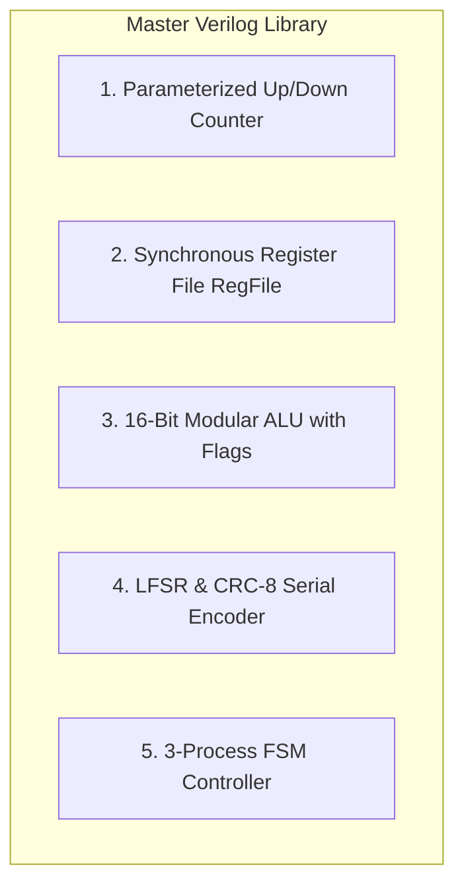
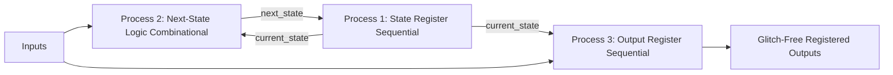

# Verilog HDL & Digital Architecture Master Guide

A comprehensive, industry-standard reference guide for **Verilog HDL Digital Design**, consolidating all hardware architectures, synthesizable modeling techniques, finite state machines, and self-checking testbench methodologies from the Digital Design Diploma.

---

##  Master Verilog Library

- **Source Code**: [`master_verilog_library.v`](file:///c:/Users/user/Desktop/DigitalDesign/Digital_Design_Diploma/1-Verilog/master_verilog_library.v)

---

##  Digital Architecture Modules Included



| Module Name | Description | Key Features |
| :--- | :--- | :--- |
| **`Master_Up_Dn_Counter`** | Parameterized Synchronous Counter | Synchronous load, enable, up/down direction, rollover terminal flags (`High`/`Low`). |
| **`Master_RegFile`** | Synchronous Register File | Configurable data width and depth ($N \times M$), synchronous read/write, valid pulse. |
| **`Master_ALU`** | 16-Bit Multi-Function ALU | Arithmetic, Logic, Shift, Compare operations, status flags (`Zero`, `Carry`, `Arith_Flag`, etc.). |
| **`Master_CRC_LFSR`** | LFSR / CRC-8 Encoder | Serial data processing with feedback taps based on polynomial $x^8 + x^2 + x + 1$. |
| **`Master_FSM_Controller`** | 3-Process FSM State Machine | Glitch-free registered outputs, clean next-state transition logic, safe default states. |

---

##  Synthesizable Verilog Coding Rules

### 1. Blocking (`=`) vs. Non-Blocking (`<=`) Assignments
Following these rules prevents pre/post-synthesis simulation mismatches and race conditions:

| Circuit Type | Procedural Block | Assignment Operator | Golden Rule |
| :--- | :--- | :---: | :--- |
| **Sequential Logic** | `always @(posedge clk or negedge rst_n)` | `<=` (Non-Blocking) | Models concurrent hardware register transfers. |
| **Combinational Logic** | `always @(*)` | `=` (Blocking) | Models immediate evaluation of boolean expressions. |
| **Continuous Assignment** | `assign wire_out = a & b;` | `=` | Wire-level continuous connections. |

> [!CAUTION]
> **Never mix blocking and non-blocking assignments inside the same `always` block.**

---

### 2. Preventing Unintentional Latches (Lab 6)
In synthesis, a combinational `always @(*)` block will infer an unwanted **D-Latch** if an output variable is not assigned a value in every possible execution branch.

#### Incorrect Code (Infers Latch):
```verilog
// BAD: Missing 'else' branch keeps 'out' memory when en=0
always @(*) begin
    if (en)
        out = data;
end
```

#### Correct Code (Latch-Free):
```verilog
// GOOD: Method A (Complete Branches)
always @(*) begin
    if (en)
        out = data;
    else
        out = 1'b0;
end

// GOOD: Method B (Default Assignment at the top)
always @(*) begin
    out = 1'b0; // Default value ensures all paths are covered
    if (en)
        out = data;
end
```

---

##  Finite State Machine (FSM) Design (3-Process Style)

The **3-Process FSM** architecture is the industry standard for robust, glitch-free control logic:



```verilog
// Process 1: State Register (Sequential)
always @(posedge CLK or negedge RST_N) begin
    if (!RST_N)
        current_state <= IDLE;
    else
        current_state <= next_state;
end

// Process 2: Next-State Logic (Combinational)
always @(*) begin
    next_state = current_state;
    case (current_state)
        IDLE: if (start) next_state = RUN;
        RUN:  if (done)  next_state = IDLE;
        default: next_state = IDLE;
    endcase
end

// Process 3: Output Logic (Registered for clean clock-aligned transitions)
always @(posedge CLK or negedge RST_N) begin
    if (!RST_N)
        out <= 1'b0;
    else case (next_state)
        RUN:     out <= 1'b1;
        default: out <= 1'b0;
    endcase
end
```

---

##  Self-Checking Testbench Template

A robust testbench contains clock generation, reset sequence, driver tasks, and automatic assertions:

```verilog
`timescale 1ns / 1ps

module tb_sample;
    // Parameters
    localparam CLK_PER = 10;

    // DUT Signals
    reg        clk;
    reg        rst_n;
    reg  [3:0] in_data;
    wire [3:0] out_data;
    integer    err_count = 0;

    // Instantiate DUT
    Master_Up_Dn_Counter #(.WIDTH(4)) dut (
        .CLK(clk),
        .RST_N(rst_n),
        .Load(1'b0),
        .Up(1'b1),
        .Down(1'b0),
        .IN(4'b0),
        .Counter(out_data),
        .High(),
        .Low()
    );

    // Clock Generator (100 MHz)
    always #(CLK_PER/2) clk = ~clk;

    // Test Sequence
    initial begin
        clk = 0;
        rst_n = 0;
        #(CLK_PER*2);
        rst_n = 1; // Release reset

        // Monitor & Verify
        #(CLK_PER*16);
        if (out_data == 4'h0)
            $display("[TEST PASSED] Counter rolled over successfully.");
        else begin
            $display("[TEST FAILED] Expected 0, got %0h", out_data);
            err_count = err_count + 1;
        end

        $finish;
    end
endmodule
```
