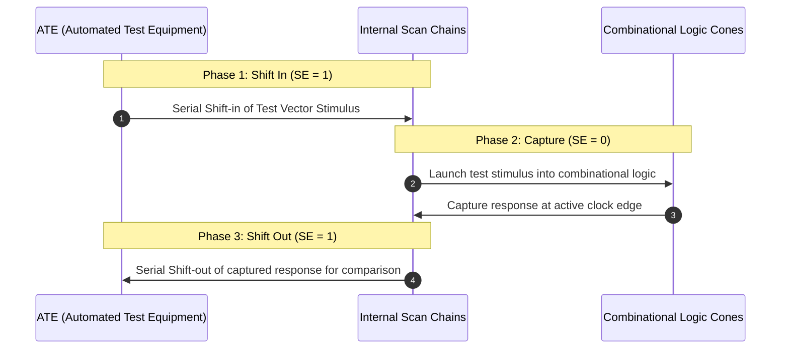
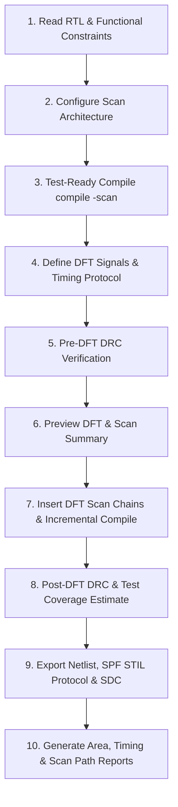

# Design for Testability (DFT) & Scan Insertion Master Guide

A comprehensive, industry-standard reference guide for **Design for Testability (DFT)** and **Scan Chain Insertion** using **Synopsys DFT Compiler (DC-DFT)**, consolidating all principles, test protocols, design rule checks (DRC), and coverage estimation from the Digital Design Diploma.

---

##  Master DFT Script

- **Script**: [`master_dft_flow.tcl`](file:///c:/Users/user/Desktop/DigitalDesign/Digital_Design_Diploma/10-DFT/master_dft_flow.tcl)

---

##  How to Run DFT Compiler

```bash
# Run DFT insertion in batch mode:
dc_shell -f master_dft_flow.tcl | tee dft.log

# Interactive GUI mode:
dc_shell -gui
```

---

##  Fundamentals of DFT & Scan Testing

### 1. Why DFT?
During fabrication in the silicon foundry, physical silicon defects (shorts, opens, bridging) can occur. 
- **Functional Testing**: Verifying logic design matches specification (RTL simulation).
- **Manufacturing Testing**: Detecting physical hardware defects in fabricated chips.

DFT transforms the complex sequential testing problem into a simple **combinational ATPG (Automatic Test Pattern Generation)** problem by replacing standard flip-flops with **Scan Flip-Flops (SDFFs)** connected into one or more shift registers called **Scan Chains**.

---

### 2. Muxed-D Scan Flip-Flop Architecture

A Scan Flip-Flop contains a 2-to-1 Multiplexer at the data input controlled by the **Scan Enable (`SE`)** signal:

```text
                  +-----+
Functional D ---->| 0   |
                  |     |-----> [ Standard D-FF ] ----> Functional Q / Scan Out
Scan In (SI) ---->| 1   |               ^
                  +-----+               |
                     |                 CLK
                Scan Enable (SE)
```

| Operating Mode | Scan Enable (`SE`) | Active Input | Purpose |
| :--- | :---: | :---: | :--- |
| **Functional / Capture Mode** | `0` | Functional `D` | Normal system operation; capture combinational logic outputs. |
| **Shift Mode** | `1` | Scan Input `SI` | Shift test vectors into flip-flops, and shift out previous test responses. |

---

##  The 3-Step Scan Testing Cycle



---

##  Step-by-Step DFT Flow in Synopsys DC-DFT



---

### Step 1: Scan Architecture Configuration
Configures scan chain parameters before cell replacement:
```tcl
set_scan_configuration -clock_mixing no_mix \
                       -style multiplexed_flip_flop \
                       -replace true \
                       -max_length 100
```
- **`-clock_mixing no_mix`**: Prevents mixing registers from different clock domains into the same chain (avoids hold time violations between clock domains).
- **`-max_length`**: Limits the number of flip-flops per chain to balance test time across chains.

---

### Step 2: Test-Ready Compilation
Replaces all standard D-Flip-Flops with unstitched Scan Flip-Flops:
```tcl
compile -scan
```

---

### Step 3: Test Timing Protocol & DFT Signal Definitions
Specifies dedicated test control pins and waveforms for the test harness:

```tcl
# Timing Protocol Variables
set test_default_period 100
set test_default_strobe 20

# Scan Clock & Scan Reset
set_dft_signal -port [get_ports scan_clk]  -type ScanClock  -view existing_dft -timing {30 60}
set_dft_signal -port [get_ports scan_rst]  -type Reset      -view existing_dft -active_state 0

# Test Mode Control (bypasses internal clock dividers)
set_dft_signal -port [get_ports test_mode] -type Constant   -view existing_dft -active_state 1
set_dft_signal -port [get_ports test_mode] -type TestMode   -view spec         -active_state 1

# Scan Enable (SE) & Data Ports (SI / SO)
set_dft_signal -port [get_ports SE]        -type ScanEnable -view spec         -active_state 1 -usage scan
set_dft_signal -port [get_ports SI]        -type ScanDataIn -view spec
set_dft_signal -port [get_ports SO]        -type ScanDataOut -view spec

# Generate Internal Test Protocol
create_test_protocol
```

---

### Step 4: Pre-DFT DRC & Scan Preview
Checks that all flip-flop clock pins and asynchronous reset pins are fully controllable from primary top-level ports in test mode:
```tcl
dft_drc -verbose
preview_dft -show scan_summary
```

---

### Step 5: Scan Insertion & Incremental Optimization
Stitches the Scan-DFFs into physical chains (`SI -> SDFF1 -> SDFF2 -> ... -> SO`) and fixes any timing degradation caused by scan routing:
```tcl
insert_dft
compile -scan -incremental
```

---

### Step 6: Post-DFT DRC & Coverage Estimation
Verifies 100% chain integrity and estimates the stuck-at fault test coverage:
```tcl
dft_drc -verbose -coverage_estimate
```

---

##  Common DFT Design Rules & Violations

| DFT Rule Violation | Cause | Solution / Fix |
| :--- | :--- | :--- |
| **D1: Clock Controllability** | Clock is driven by internal logic / divider and cannot be pulsed by tester. | Add a MUX controlled by `test_mode` to bypass internal divider with top-level `scan_clk`. |
| **D2: Reset Controllability** | Asynchronous reset is asserted during shift mode, corrupting scan data. | Gate or MUX reset with `test_mode` so it is disabled during shift. |
| **Clock Domain Mixing** | Mixing different clocks in one chain causes hold violations during shift. | Use `set_scan_configuration -clock_mixing no_mix`. |
| **Trailing Edge Flops** | Negative-edge flops placed before positive-edge flops in the same chain cause data loss. | DFT Compiler places negative-edge flops **first** in the chain automatically. |

---

##  Post-DFT Deliverables for TetraMAX ATPG

| File | Format | Purpose |
| :--- | :--- | :--- |
| **`<top>_dft.v`** | Verilog | Gate-level Netlist with inserted scan chains for ATPG & PnR. |
| **`<top>_dft.spf`** | STIL Procedure File | Standard Test Interface Language file defining test protocols for TetraMAX. |
| **`<top>_dft.ddc`** | Synopsys DDC | Binary database preserving DFT attributes and mapping. |
| **`scan_paths.rpt`** | Text Report | Detailed cell-by-cell list of all stitched scan chains. |
