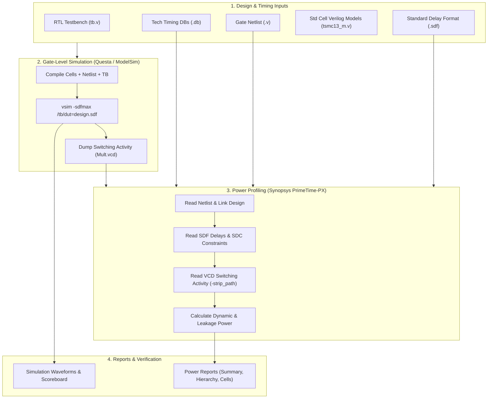
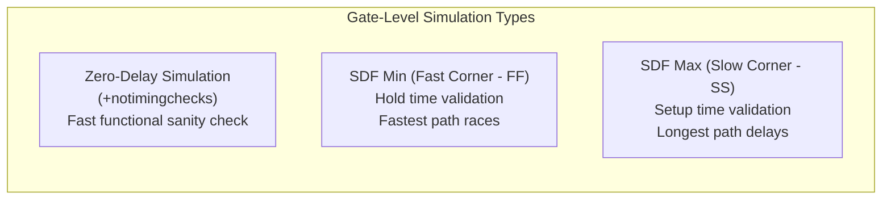

# Gate-Level Simulation (GLS) & Power Analysis Master Guide

A comprehensive, industry-standard reference guide for **Gate-Level Simulation (GLS)** using **ModelSim / QuestaSim** and dynamic **Power Analysis** using **Synopsys PrimeTime-PX (PT-PX)**, consolidating all simulation principles, timing back-annotation, unknown (`X`) propagation handling, switching activity generation, and power profiling from the Digital Design Diploma.

---

##  Master GLS & Power Script

- **Master Script**: [`master_gls_flow.tcl`](file:///c:/Users/user/Desktop/DigitalDesign/Digital_Design_Diploma/11-GLS/master_gls_flow.tcl)

---

##  How to Run GLS & PrimeTime-PX

### 1. Running Gate-Level Simulation (ModelSim / QuestaSim)
```bash
# In simulation directory (GUI Mode):
vsim -do run.do

# In Batch / Command-Line Mode:
vsim -c -do run.do
```

### 2. Running PrimeTime-PX Power Analysis
```bash
# Run in batch mode:
pt_shell -f master_gls_flow.tcl | tee pt_power.log

# Interactive GUI mode:
pt_shell -gui
# Inside pt_shell:
source master_gls_flow.tcl
```

---

##  GLS & Power Analysis Flow Architecture



---

##  Why Perform Gate-Level Simulation (GLS)?

While **Static Timing Analysis (STA)** and **Logic Equivalence Checking (LEC)** verify timing and logic equivalence respectively, GLS is critical to catch system-level dynamic issues that STA and LEC cannot model:

1. **Asynchronous Reset Removal / Recovery Validation**: Verifies that reset signals cleanly de-assert without placing flip-flops into metastable states.
2. **Clock Domain Crossing (CDC) Functionality**: Validates handshake protocols, FIFOs, and synchronizers with real physical delays.
3. **Multi-Cycle and False Path Verification**: STA treats false paths as disabled and multi-cycle paths as relaxed; GLS proves whether the RTL design logic actually functions correctly without race conditions on these paths.
4. **Glitch Detection & Hazard Analysis**: Catches functional glitches on asynchronous set/reset pins, clock-gating enable lines, and multiplexer select lines.
5. **Dynamic Power Profiling**: Generates exact toggle counts and switching activity files (`.vcd` / `.fsdb` / `.saif`) to feed into PrimeTime-PX for accurate dynamic and peak power calculation.

---

##  Types of Gate-Level Simulation



| Mode | Command Flag | Back-Annotated Delays | Primary Purpose |
| :--- | :--- | :--- | :--- |
| **Zero-Delay (Unit-Delay)** | `+notimingchecks` | 0 ns (or unit delta) | Pure functional verification of synthesized gates without timing delays. |
| **SDF Max (Slow Corner)** | `-sdfmax /tb/dut=file.sdf` | Max Cell & Interconnect Delays | Setup time ($T_{\text{setup}}$) verification and worst-case latency under minimum voltage / highest temperature ($SS / 1.08\text{V} / 125^\circ\text{C}$). |
| **SDF Min (Fast Corner)** | `-sdfmin /tb/dut=file.sdf` | Min Cell & Interconnect Delays | Hold time ($T_{\text{hold}}$) race condition checking under maximum voltage / lowest temperature ($FF / 1.32\text{V} / -40^\circ\text{C}$). |
| **SDF Typ (Typical Corner)**| `-sdftyp /tb/dut=file.sdf` | Nominal Delays | Typical performance and nominal power characterization ($TT / 1.2\text{V} / 25^\circ\text{C}$). |

---

##  Common GLS Pitfalls & Troubleshooting

### 1. Unknown (`X`) State Pessimism
In RTL simulation, uninitialized flip-flops often resolve conditionally, but in gate-level standard cells:
- An uninitialized flip-flop output starts as `'X'`.
- Any logic gate receiving `'X'` propagates `'X'` across downstream logic cones, causing whole blocks to show `X` indefinitely.
- **Remedy**:
  - Apply clean asynchronous reset pulses at $t=0$.
  - Initialize non-resettable datapath registers via simulator init commands (`+acc`, `force`, or `$deposit`).

### 2. Timing Violations & Notifiers
When setup/hold timing violations occur in standard cells with timing checks enabled, internal Verilog specify blocks trigger the **notifier register**, corrupting the flip-flop output to `'X'`:
```verilog
// Standard Cell Specify Block Example:
specify
    $setup(D, posedge CK, 0.150, notifier);
    $hold(posedge CK, D, 0.080, notifier);
endspecify
```
- **Remedy**:
  - Suppress false violations during initial reset sequence using `+notimingchecks` or `+no_notifier`.
  - Ensure clocks and asynchronous inputs are phase-aligned to the SDC specification.

---

##  Power Analysis Flow (Synopsys PrimeTime-PX)

PrimeTime-PX calculates total power dissipation using the equation:

$$P_{\text{total}} = P_{\text{dynamic}} + P_{\text{static}} = \left( P_{\text{internal}} + P_{\text{switching}} \right) + P_{\text{leakage}}$$

- **Internal Power ($P_{\text{internal}}$)**: Power consumed inside standard cells during input transitions (short-circuit / crowbar current and internal charging).
- **Switching Power ($P_{\text{switching}} = \frac{1}{2} C_{\text{load}} V_{DD}^2 \cdot f \cdot \alpha$)**: Power dissipated charging and discharging external load capacitance and interconnect wires ($\alpha$ = switching activity from VCD).
- **Leakage Power ($P_{\text{leakage}} = V_{DD} \cdot I_{\text{leakage}}$)**: Static power dissipated due to subthreshold and gate-oxide leakage when the cell is idle.

### PrimeTime-PX Tcl Command Sequence
```tcl
# 1. Enable Power Mode
set_app_var power_enable_analysis true
set_app_var power_analysis_mode   time_based

# 2. Read Gate Netlist, Constraints & Libraries
read_verilog "./syn/results_mul/alu8_top_netlist.v"
current_design alu8_top
link_design
read_sdc "./syn/results_mul/alu8_top.sdc"
read_sdf "./syn/results_mul/alu8_top.sdf"

# 3. Annotate Switching Activity from VCD
read_vcd -strip_path tb/dut "./sim/VCD/Mult.vcd"

# 4. Calculate & Report Power
update_power
report_power > "./pt_reports/power_summary.rpt"
report_power -hierarchy > "./pt_reports/power_hierarchy.rpt"
```

---

##  File Formats in GLS & Power Analysis

| File Format | Full Name | Purpose & Contents | Primary Tools |
| :--- | :--- | :--- | :--- |
| **`.v`** | Verilog Netlist | Gate-level structural interconnect netlist | DC, Encounter, QuestaSim, PT |
| **`.sdf`** | Standard Delay Format | Accurate gate and interconnect propagation delays ($T_{pd}$, $T_{\text{setup}}$, $T_{\text{hold}}$) | DC / Encounter $\rightarrow$ QuestaSim / PT |
| **`.vcd`** | Value Change Dump | Event-based digital waveform recording transitions & timestamps | ModelSim / QuestaSim $\rightarrow$ PT-PX |
| **`.fsdb`** | Fast Signal Database | Compressed binary switching activity and waveform database | Synopsys VCS / Verdi / PT-PX |
| **`.saif`** | Switching Activity Interchange Format | Statistical toggle rates and duty cycles for averaged power | ModelSim / DC / PT-PX |
| **`.db`** | Synopsys Binary Library | Standard cell timing, internal power tables, and leakage values | Synopsys DC, PT-PX |
| **`.sdc`** | Synopsys Design Constraints | Clock frequencies, I/O delays, operating conditions | DC, PrimeTime, QuestaSim |

---

##  GLS Labs Directory Structure

```text
11-GLS/
├── README.md                      # Complete Gate-Level Simulation & Power Guide
├── master_gls_flow.tcl            # Unified PrimeTime-PX power & simulation orchestration
├── Assignments/
│   └── Ass_GLS_1.0.pdf            # GLS Assignment specification & instructions
└── Labs/
    └── 1-Lab_GLS_1.0/
        ├── rtl/                   # Original Verilog RTL designs
        ├── syn/                   # Synthesized gate-level netlists & SDF files
        │   ├── cons.tcl           # Synthesis constraints
        │   ├── syn_script.tcl     # DC synthesis flow
        │   └── results_mul/       # Generated netlist (.v), .sdc, and .sdf
        ├── std_cells/             # Standard cell Verilog models & .db libraries
        │   ├── tsmc13_m.v         # Behavioral Verilog simulation models
        │   └── *.db               # Multi-corner PVT timing & power databases
        ├── sim/                   # Simulation workspace
        │   ├── tb.v               # Testbench with VCD dumping tasks
        │   ├── run.do             # Questa/ModelSim compilation & execution script
        │   ├── wave.do            # Waveform signal viewer configuration
        │   └── VCD/               # Generated switching activity files (.vcd)
        ├── pt/                    # PrimeTime-PX power analysis workspace
        │   ├── PT.tcl             # PT-PX power analysis script
        │   └── report/            # Power reports
        └── solution/              # Golden reference solution and results
```
