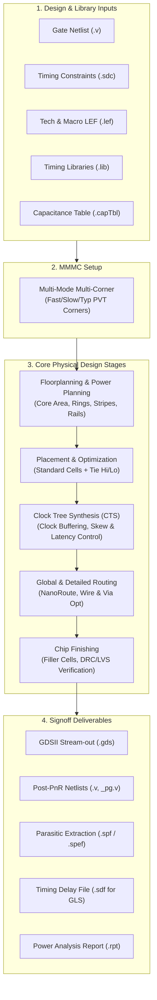

# Physical Design (Place & Route - PnR) Master Guide

A comprehensive, industry-standard reference guide for **Physical Design (PnR)** using **Cadence Encounter / Innovus**, consolidating all physical design steps, power planning, standard cell placement, Clock Tree Synthesis (CTS), global & detailed routing, chip finishing, and signoff export from the Digital Design Diploma.

---

##  Master PNR Script

- **Master Script**: [`master_pnr_flow.tcl`](file:///c:/Users/user/Desktop/DigitalDesign/Digital_Design_Diploma/12-PNR/master_pnr_flow.tcl)

---

##  How to Run Encounter / Innovus

```bash
# Run in batch mode with full console logging:
encounter -nowin -init master_pnr_flow.tcl | tee pnr.log

# Interactive GUI mode:
encounter
# Inside Encounter shell:
source master_pnr_flow.tcl
```

---

##  Physical Design Flow Architecture



---

##  Stage-by-Stage Deep Dive

### 1. Design Import & MMMC Setup
Physical design requires both physical geometry data (LEF), functional connectivity (synthesized gate-level netlist), timing constraints (SDC), and parasitic modeling (CapTable):

- **Tech LEF**: Defines metal layers, design rules, pitches, min width/spacing, and via definitions.
- **Macro LEF**: Provides abstract boundary geometries, pin locations, and obstruction layers for standard cells and hard macros.
- **MMMC (Multi-Mode Multi-Corner)**: Configures independent analysis views for worst-case setup (`max_library` @ SS 1.08V 125°C) and best-case hold (`min_library` @ FF 1.32V -40°C).

```tcl
# Configure UI Variables:
setUIVar rda_Input ui_topcell        "ALU_TOP"
setUIVar rda_Input ui_netlist        "./dft/ALU_TOP.v"
setUIVar rda_Input ui_leffile        [list $TECH_LEF $MACRO_LEF $DESIGN_LEF]
setUIVar rda_Input ui_timelib,min    $FFLIB
setUIVar rda_Input ui_timelib,max    $SSLIB
setUIVar rda_Input ui_timelib        $TTLIB
commitConfig
```

---

### 2. Floorplanning & Power Planning
Floorplanning defines the physical size of the chip, core-to-IO boundaries, aspect ratio, and the Power Delivery Network (PDN):

- **Core Dimensions**: Defined using length, width, and margins:
  $$\text{Aspect Ratio} = \frac{\text{Height}}{\text{Width}}, \quad \text{Core Utilization} = \frac{\text{Standard Cell Area}}{\text{Total Core Area}}$$
- **Power Delivery Network (PDN)**:
  - **Power Rings**: Core boundary rings carrying `VDD` and `VSS` around the core area.
  - **Power Stripes**: Vertical/horizontal metal stripes running across upper metal layers to distribute current evenly and minimize IR drop.
  - **Standard Cell Rails (Followpins)**: Metal 1 horizontal rails connected to standard cell power/ground pins.

```tcl
# Define Floorplan Dimensions & Core-to-IO Margins (3.0 um on all sides):
floorPlan -d 120.13 120.13 3.0 3.0 3.0 3.0
```

---

### 3. Standard Cell Placement & Tie-Cell Insertion
Placement places all standard cell instances legally inside standard cell rows while minimizing total wirelength and cell congestion:

- **Pre-Placement Optimization**: Logic restructuring and high-fanout net buffering before cell coordinates are fixed.
- **In-Place Optimization (IPO)**: Buffer insertion, gate sizing, and local swapping during placement to satisfy timing constraints.
- **Tie-High / Tie-Low Insertion**: Unused gate inputs tied to logic `'1'` or `'0'` must not connect directly to VDD/VSS rails (to avoid ESD damage and oxide breakdown). Specialized `TIEHIM` and `TIELOM` cells protect the transistors.
- **Global Net Connect**: Explicitly binds power/ground pins of all instances to `VDD` and `VSS`.

```tcl
placeDesign -inPlaceOpt -prePlaceOpt
addTieHiLo -cell TIELOM -prefix LTIE
addTieHiLo -cell TIEHIM -prefix HTIE
globalNetConnect VDD -type pgpin -pin VDD -inst *
globalNetConnect VSS -type pgpin -pin VSS -inst *
```

---

### 4. Clock Tree Synthesis (CTS)
Before CTS, clock nets are treated as ideal with zero delay. CTS builds a physical balanced buffer tree to distribute the clock from the root pin to every flip-flop clock input pin:

- **Target Metrics**:
  - **Clock Skew**: Maximum arrival time difference between any two flip-flop clock pins ($\le 200\text{ ps}$).
  - **Insertion Delay (Latency)**: Time taken for the clock signal to propagate from source pin to sink pins.
  - **Transition Time (Slew)**: Maximum rise/fall transition ($\le 50\text{ ps}$).
- **Specification File (`.ctstch`)**: Defines root pin, clock period, max skew, allowed buffer list (`CLKBUFX*`, `CLKINVX*`), and routing layers.

```tcl
# Generate CTS Specification:
clockDesign -genSpecOnly Clock.ctstch

# Execute Clock Tree Synthesis:
clockDesign -specFile Clock.ctstch -outDir clock_report -fixedInstBeforeCTS
```

---

### 5. Global & Detailed Routing (NanoRoute)
Routing replaces abstract net connectivity with physical metal interconnect tracks:

- **Global Routing**: Partitions the chip into a grid of global routing cells (G-cells) and plans coarse routing paths without assigning specific tracks.
- **Track Assignment**: Assigns nets to specific tracks on designated metal layers (horizontal vs. vertical alternating layers).
- **Detailed Routing (NanoRoute)**: Creates exact geometric wire paths and inserts vias while strictly satisfying metal spacing, min area, and width DRC rules.
- **Optimization**: `-viaOpt` reduces via count / replaces with double vias for yield; `-wireOpt` spreads wires to minimize crosstalk capacitance.

```tcl
setNanoRouteMode -quiet -routeTopRoutingLayer 6
routeDesign -globalDetail -viaOpt -wireOpt
```

---

### 6. Chip Finishing & Physical Verification
Prepares the layout for mask generation and foundry manufacturing:

- **Filler Cell Insertion**: Standard cells leave empty gaps along rows. Filler cells (`FILL1M` to `FILL64M`) contain no active logic but maintain continuous N-well and P-substrate implant layers, preventing DRC design rule violations.
- **Antenna Violation Check & Fixing**: Long metal routes collect static charge during plasma etching which can rupture thin gate oxides. Antenna diodes or upper-layer jumper metal routing dissipate charge safely.
- **Verification**: `verifyGeometry` (DRC checks) and `verifyConnectivity` (open/short checks).

```tcl
# Add Filler Cells:
set filler_cell_list {FILL1M FILL2M FILL4M FILL8M FILL16M FILL32M FILL64M}
addFiller -cell $filler_cell_list -prefix FILLER -markFixed

# Physical Verification Checks:
verifyGeometry -report geometry_drc.rpt
verifyConnectivity -type all -report connectivity.rpt
```

---

### 7. Signoff Export & Output Deliverables
Generates all signoff files required for downstream flows (LVS, Formal Verification, GLS, and Tape-Out):

- **Logical Netlist (`.v`)**: Post-layout gate netlist for Gate-Level Simulation (GLS) and Formal Verification (LEC).
- **Physical Netlist (`_pg.v`)**: Includes explicit `VDD` and `VSS` port connections for Layout Versus Schematic (LVS) checking.
- **SPEF / SPF (`.spf`)**: Extracted parasitic resistance and capacitance values used by PrimeTime STA.
- **SDF (`.sdf`)**: Standard Delay Format file containing calibrated cell and interconnect delays for back-annotated timing simulation.
- **GDSII (`.gds`)**: The final binary layout stream file for mask fabrication at the silicon foundry.

```tcl
# Export Netlists:
saveNetlist export/ALU_TOP.v
saveNetlist export/ALU_TOP_pg.v -includePowerGround

# Parasitics & Timing Delays:
rcOut -spf export/ALU_TOP.spf
delayCal -sdf export/ALU_TOP.sdf -version 3.0

# Stream-out GDSII Layout:
streamOut export/ALU_TOP.gds -mapFile ./import/gds2InLayer.map -libName DesignLib -stripes 1 -units 2000 -mode ALL
```

---

##  Physical Design File Formats Summary

| File Format | Full Name | Purpose & Contents | Primary Tool / Consumer |
| :--- | :--- | :--- | :--- |
| **`.lef`** | Library Exchange Format | Physical layout abstract (Tech rules, standard cell dimensions, pin locations, obstructions) | Encounter / Innovus / Virtuoso |
| **`.def`** | Design Exchange Format | Complete physical layout database (floorplan, cell coordinates, net routing geometries) | PnR Tools / DRC / LVS |
| **`.capTbl`** | Capacitance Table | Technology interconnect RC extraction modeling tables across layer stacks | Encounter RC Extraction |
| **`.sdc`** | Synopsys Design Constraints | Timing constraints (clocks, IO delays, clock uncertainties, multicycle paths) | DC, Encounter, PrimeTime |
| **`.ctstch`** | Clock Tree Spec File | Clock routing constraints, allowed clock buffers/inverters, skew/latency targets | Encounter CTS Engine |
| **`.spf` / `.spef`** | Standard Parasitic Exchange Format | Detailed parasitic Resistance ($R$) and Capacitance ($C$) for every net | PrimeTime STA / StarRC |
| **`.sdf`** | Standard Delay Format | Calibrated cell and net interconnect delay timing file | ModelSim / QuestaSim (GLS) |
| **`.gds` / `.gds2`** | GDSII Stream Format | Binary mask layout geometry format sent to the semiconductor foundry for tape-out | Foundry / Calibre DRC-LVS |

---

##  PnR Labs Directory Structure

```text
12-PNR/
├── README.md                      # Complete Physical Design reference guide
├── master_pnr_flow.tcl            # Unified Cadence Encounter/Innovus master script
└── Labs/
    └── 1-Lab_PNR_1/
        ├── Lab_PNR_1.0.pdf        # Lab manual & design requirements
        ├── dft/                   # Post-DFT synthesized netlists (.v, .sdc, .ddc)
        ├── std_cells/             # Technology LEF, CapTables, and .lib views
        │   ├── captables/         # tsmc13fsg.capTbl
        │   ├── lef/               # tsmc13fsg_7lm_tech.lef, tsmc13_m_macros.lef
        │   └── libs/              # Multi-corner PVT timing libraries (.lib)
        ├── pnr/                   # Individual stage PnR scripts
        │   ├── des_import.tcl     # Step 1: Design import & MMMC setup
        │   ├── floorplan.tcl      # Step 2: Floorplanning & die bounding
        │   ├── placement.tcl      # Step 3: Standard cell placement & tie cells
        │   ├── cts.tcl            # Step 4: Clock tree synthesis & spec
        │   ├── routing.tcl        # Step 5: Global & detailed NanoRoute
        │   ├── chip_finish.tcl    # Step 6: Filler cell insertion
        │   ├── outputs_gen.tcl    # Step 7: Netlists, SPF, SDF & GDSII export
        │   ├── import/            # LEF & MMMC configuration files
        │   ├── report/            # Power, geometry DRC, and connectivity reports
        │   └── export/            # Generated outputs (.v, .spf, .sdf, .gds)
        └── solution/              # Golden reference database and command logs
```
