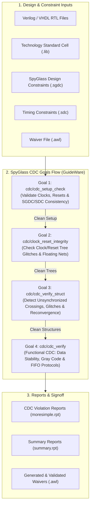
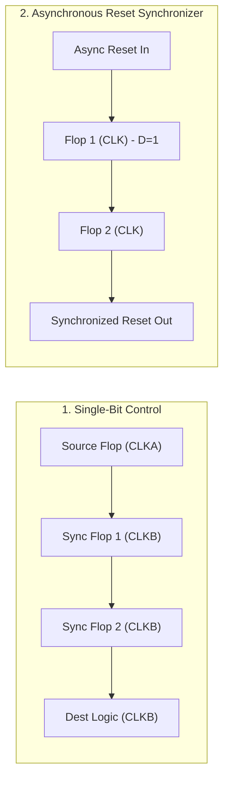

# SpyGlass Clock Domain Crossing (CDC) Master Guide

A comprehensive, industry-standard reference guide for **Clock Domain Crossing (CDC) Verification** using **Synopsys SpyGlass CDC**, consolidating all metastability fundamentals, synchronizer architectures, SGDC constraint writing, structural and functional CDC goals, violation diagnosis, and signoff reporting from the Digital Design Diploma.

---

##  Master SpyGlass CDC Script

- **Master Script**: [`master_spyglass_cdc_flow.tcl`](file:///c:/Users/user/Desktop/DigitalDesign/Digital_Design_Diploma/3-SpyGlass/CDC/master_spyglass_cdc_flow.tcl)

---

##  How to Run SpyGlass CDC

```bash
# Run automated batch flow using TCL script:
spyglass -tcl master_spyglass_cdc_flow.tcl | tee cdc_flow.log

# Run project directly in batch mode with specific goals:
spyglass -batch -project top.prj -goals cdc/cdc_setup_check,cdc/clock_reset_integrity,cdc/cdc_verify_struct,cdc/cdc_verify

# Launch interactive GUI mode:
spyglass -project top.prj &
```

---

##  SpyGlass CDC Verification Flow Architecture



---

##  CDC Fundamentals & Synchronization Architectures

### 1. What is Clock Domain Crossing (CDC)?
When a signal generated in a source clock domain ($\text{CLK}_A$) is sampled by a destination clock domain ($\text{CLK}_B$) with asynchronous phase or frequency relationship, setup and hold time requirements at the destination flip-flop will inevitably be violated, causing **Metastability**.

### 2. Mean Time Between Failures (MTBF)
The reliability of a synchronizer is measured by its MTBF:

$$\text{MTBF} = \frac{e^{\frac{T_{\text{res}}}{\tau}}}{T_0 \cdot f_{\text{clk}} \cdot f_{\text{data}}}$$

- $T_{\text{res}}$: Resolution time available for the signal to settle before the next clock edge.
- $\tau, T_0$: Flip-flop fabrication and technology parameters.
- $f_{\text{clk}}, f_{\text{data}}$: Destination clock frequency and incoming data toggle rate.

---

### 3. Industry-Standard CDC Synchronizers



| Synchronizer Architecture | Target Signal Type | How it Works |
| :--- | :--- | :--- |
| **2-Flip-Flop (2-FF) Synchronizer** | Single-Bit Control | Cascades 2 destination flip-flops to allow metastable signals to resolve before logic sampling. |
| **Reset Synchronizer (Async Assert / Sync Deassert)** | Active-Low / High Resets | Asserts reset immediately upon asynchronous pulse, but releases reset synchronously on destination clock edge. |
| **Mux-Recirculation / Data Synchronizer** | Multi-Bit Data Bus | Source logic holds data steady while a single-bit pulse synchronizer controls the destination MUX enable. |
| **Handshake Controller (Req/Ack)** | Multi-Bit Data Bus | 4-phase or 2-phase full-duplex request and acknowledge handshaking between domains. |
| **Asynchronous FIFO with Gray Pointers** | High-Throughput Streaming Bus | Uses dual-port RAM and Gray-coded write/read pointers synchronized across domains via 2-FF bridges. |

---

##  SpyGlass Design Constraints (SGDC) Directives

The `.sgdc` constraint file supplies SpyGlass with physical clock domains, reset properties, and synchronizer definitions:

```tcl
current_design top

# 1. Clock Definitions (assigns physical clock nets to domain groups)
clock -name "top.clk_a" -domain d_clka -period 10 -waveform {0 5}
clock -name "top.clk_b" -domain d_clkb -period 25 -waveform {0 12.5}

# 2. Reset Definitions
reset -name "top.rst_n" -value 0 -async

# 3. Port Clock Domain Binding
abstract_port -ports DATA_IN  -clock top.clk_a
abstract_port -ports DATA_OUT -clock top.clk_b

# 4. Quasi-Static Signals (static config registers that never toggle in operation)
quasi_static -name "top.u_reg_file.mode_config"
quasi_static -name "top.u_reg_file.baud_divisor"

# 5. Set Case Analysis (forces static mode settings for CDC evaluation)
set_case_analysis -name "top.test_mode" -value 0
set_case_analysis -name "top.scan_enable" -value 0

# 6. Reset & Cell Synchronizer Definitions
reset_synchronizer -name "top.u_rst_sync.sync_rst_n"
sync_cell -name "DF_Sync"

# 7. Unrelated Asynchronous Domain Pairings
cdc_attribute -unrelated {top.clk_a top.clk_b}
```

---

##  Key SpyGlass CDC Rules & Violation Diagnosis

| SpyGlass Rule ID | Severity | Description | Root Cause & Resolution |
| :--- | :---: | :--- | :--- |
| **`Ac_unsync01`** | **Error** | Unsynchronized scalar crossing | A 1-bit control signal crosses clock domains without a 2-FF synchronizer. Insert a 2-FF synchronizer. |
| **`Ac_unsync02`** | **Error** | Unsynchronized multi-bit bus crossing | Multi-bit data bus crossed without FIFO, handshake, or Gray code. Individual bits skew into different cycles. Use Async FIFO or MUX synchronizer. |
| **`Ac_conv01`** | **Warning** | Reconvergence of synchronized signals | Multiple synchronized signals converge into the same combinational logic gate in destination domain, causing race conditions due to variable cycle latency ($1$ or $2$ cycles). Restructure logic into a single control token. |
| **`Ac_conv02`** | **Warning** | Reconvergence of synchronized and unsynchronized signals | An unsynchronized path merges with a synchronized path. Eliminate the unsynchronized path. |
| **`Ac_glitch01`** | **Error** | Combinational logic glitch on synchronizer input | Combinational gates placed between source flop output and destination synchronizer input can cause glitch sampling. Always register signals before domain crossing. |
| **`Ar_sync01`** | **Error** | Asynchronous reset domain crossing | Asynchronous reset signal originates in a foreign clock domain without a reset synchronizer bridge. Use an Async-Assert / Sync-Deassert reset synchronizer. |
| **`Clock_glitch01`** | **Error** | Glitchy clock multiplexing | Switching between clocks using standard logic gates instead of glitch-free clock multiplexers (ICGs/Glitch-free Muxes). |
| **`Clock_info01`** | **Info** | Clock domain definition report | Confirms all clocks and inferred domains. Verify no clock is left unconstrained. |
| **`Ac_fifo01`** | **Error** | Gray code pointer error in Async FIFO | FIFO write/read pointer transitions by more than 1 bit in a single cycle. Ensure Gray code sequence is strictly adhered to. |

---

##  Waiver Management (`.awl` Files)

When violations are verified by design architecture to be safe (such as static configuration registers or software-controlled paths), waivers must be cleanly documented:

```tcl
# SpyGlass Waiver Example (top_waivers.awl):
waive -rule "Ac_unsync01" -from "top.u_ctrl.static_reg" -to "top.u_dsp.cfg_in" \
      -comment "Quasi-static register configured only during system initialization."
```

---

##  CDC Labs Directory Structure

```text
3-SpyGlass/CDC/
├── README.md                      # Complete SpyGlass CDC reference guide
├── master_spyglass_cdc_flow.tcl   # Unified multi-goal SpyGlass CDC master script
└── Labs/
    ├── 1-Lab_CDC_1.0/             # Basic CDC concepts, scalar crossings, 2-FF synchronizers
    │   ├── rtl/                   # Lab 1 RTL sources
    │   ├── spyglass/              # lab0_cdc_1.0.prj, lab0_cdc.sgdc
    │   └── std_cells/             # Standard cell timing views
    ├── 2-Lab_CDC_1.1/             # Multi-domain clock setups, reset synchronizers
    │   ├── rtl/                   # System RTL sources
    │   └── spyglass/              # CDC.prj, system.sgdc
    └── 3-Lab_CDC_1.2/             # Complete SoC verification (Async FIFO, Gray sync, SDC import)
        ├── rtl/                   # Full chip hierarchical RTL
        ├── spyglass/              # top.prj, top.sgdc, top.sdc
        └── std_cells/             # TSMC 130nm standard cells
```
