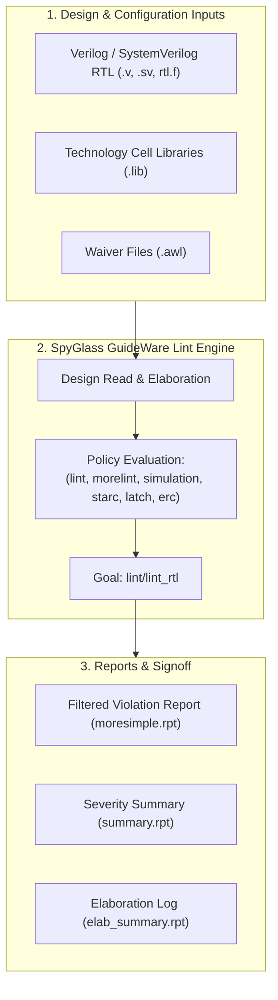

# SpyGlass RTL Linting & Static Analysis Master Guide

A comprehensive, industry-standard reference guide for **RTL Linting and Static Verification** using **Synopsys SpyGlass Lint**, consolidating all design rule policies, simulation-vs-synthesis mismatch prevention, latch elimination, coding standards, and signoff reporting from the Digital Design Diploma.

---

##  Master SpyGlass Lint Script

- **Master Script**: [`master_spyglass_lint_flow.tcl`](file:///c:/Users/user/Desktop/DigitalDesign/Digital_Design_Diploma/3-SpyGlass/Lint/master_spyglass_lint_flow.tcl)

---

##  How to Run SpyGlass Lint

```bash
# Run automated batch flow using TCL script:
spyglass -tcl master_spyglass_lint_flow.tcl | tee lint_flow.log

# Run project in batch mode directly with the lint_rtl goal:
spyglass -batch -project lint.prj -goals lint/lint_rtl

# Launch interactive GUI mode:
spyglass -project lint.prj &
```

---

##  SpyGlass Lint Flow Architecture



---

##  Why Perform RTL Linting?

RTL Linting is static analysis performed directly on source code before logic synthesis:

1. **Catches Simulation vs. Synthesis Mismatches**: Unintended behavioral discrepancies between RTL simulation and synthesized gate-level netlists.
2. **Eliminates Inadvertent Latches**: Detects incomplete conditional assignments (`if-else` or `case`) in combinational always blocks.
3. **Prevents Timing and Race Hazards**: Enforces non-blocking (`<=`) for sequential logic and blocking (`=`) for combinational logic.
4. **Identifies Structural Bugs Early**: Flags unconnected ports, floating inputs, undriven outputs, and multi-driven nets long before physical implementation.
5. **Ensures Synthesis & DFT Readiness**: Enforces STARC / OpenMORE coding standards for optimal logic mapping and scan chain testability.

---

##  Core SpyGlass Lint Policies & Rule Groups

| Policy Name | Description | Key Focus Areas |
| :--- | :--- | :--- |
| **`lint`** | Base structural & semantic checks | Syntax correctness, constant conditions, type mismatches |
| **`morelint`** | Advanced coding style rules | Unloaded outputs (`UnloadedOutTerm-ML`), unused variables, naming conventions |
| **`simulation`** | Simulation-synthesis equivalence | Blocking vs non-blocking assignments (`W415`), `full_case`/`parallel_case` directives (`W398`), sensitivity lists (`W18`) |
| **`latch`** | Unintended sequential storage | Inferred latches (`InferLatch`, `W188`) in combinational always blocks |
| **`erc`** | Electrical Rule Checks | Combinational loops (`W120`, `W121`), multi-driven nets (`W422`), floating inputs (`W240`) |
| **`starc` / `starc2005`** | Industry design standards | Clock/reset naming, synchronous design rules, DFT-friendly coding |

---

##  Common SpyGlass Lint Rules & Fixes

| Rule ID | Severity | Problem Description | Root Cause & Correct Code Fix |
| :--- | :---: | :--- | :--- |
| **`InferLatch` / `W188`** | **Error** | Inferred latch in combinational block | Missing `else` in `if` branch or missing cases in `case` statement. <br>**Fix**: Provide default value assignments at the top of the `always` block. |
| **`W415`** | **Warning** | Blocking assignment (`=`) used in sequential block | Using `=` inside `always @(posedge clk)` causes simulation race conditions. <br>**Fix**: Use non-blocking assignments (`<=`) for all sequential registers. |
| **`W416`** | **Warning** | Non-blocking assignment (`<=`) in combinational block | Using `<=` inside `always @(*)` causes unnecessary simulation delta-cycle delays. <br>**Fix**: Use blocking assignments (`=`) for combinational logic. |
| **`W18`** | **Warning** | Incomplete sensitivity list | Missing signals in `always @(a or b)`. <br>**Fix**: Use SystemVerilog `always_comb` or Verilog-2001 `always @(*)`. |
| **`W120` / `W121`** | **Error** | Combinational feedback loop detected | Output of combinational gate feeds back to its input without an intervening register. <br>**Fix**: Break loop using a flip-flop. |
| **`W164a` / `W164b`** | **Warning** | Truncation / bit-width mismatch in assignment | Assigning a wider vector to a narrower vector (e.g. `wire [3:0] a = 8'hFF`). <br>**Fix**: Align bus widths explicitly or use slice indexing. |
| **`W240`** | **Warning** | Declared input/signal is unused | Input port or internal wire declared but not connected in module body. <br>**Fix**: Connect signal or safely remove declaration. |
| **`W528`** | **Warning** | Variable set but not read | Signal is assigned a value but never sampled downstream. <br>**Fix**: Remove redundant assignments or verify datapath connectivity. |
| **`UnloadedOutTerm-ML`** | **Info** | Sub-module output port is unconnected | An output port of an instantiated child module is left hanging. <br>**Fix**: Connect to net or document intentionally unused status. |
| **`W398`** | **Warning** | Use of `full_case` or `parallel_case` | Synthesis pragmas cause simulator and synthesis tool to interpret logic differently. <br>**Fix**: Remove pragmas and code explicit default conditions in HDL. |

---

##  Golden Rules for Clean RTL Design

```verilog
// 1. Clean Combinational Logic Pattern (always_comb or always @(*))
always @(*) begin
    // Always assign default values first to guarantee NO latches:
    out_valid = 1'b0;
    out_data  = 8'h00;

    if (enable) begin
        out_valid = 1'b1;
        out_data  = in_a + in_b;
    end
end

// 2. Clean Sequential Logic Pattern (always_ff or always @(posedge clk or negedge rst_n))
always @(posedge clk or negedge rst_n) begin
    if (!rst_n) begin
        // Fully reset all sequential registers:
        reg_data <= 8'h00;
        reg_val  <= 1'b0;
    end else begin
        // Always use non-blocking (<=) assignments:
        reg_data <= out_data;
        reg_val  <= out_valid;
    end
end
```

---

##  Waiver Management (`.awl` Files)

Document and justify all benign lint messages:

```tcl
# SpyGlass Lint Waiver File (lint_waivers.awl)
waive -rule "UnloadedOutTerm-ML" -module "ALU_TOP" -comment "Optional status flag left unconnected by design."
waive -rule "W164a" -file "ALU.v" -line 45 -comment "Intentional truncation of adder carry-out bit."
```

---

##  Lint Labs Directory Structure

```text
3-SpyGlass/Lint/
├── README.md                      # Complete SpyGlass Lint reference guide
├── master_spyglass_lint_flow.tcl   # Unified SpyGlass Lint master script
└── Labs/
    ├── 1-Lab_Lint_1.0/            # Lab 1: Basic linting, filelist setup, unloaded outputs
    │   ├── rtl/                   # ALU_TOP RTL sources & rtl.f filelist
    │   ├── solution/spyglass/     # lint.prj & moresimple.rpt golden reports
    │   └── std_cells/             # TSMC 130nm library views
    ├── 2-Lab_Lint_1.1/            # Lab 2: Simulation vs. synthesis mismatches, W415, W18
    ├── 3-Lab_Lint_1.2/            # Lab 3: Latch inference diagnostics & fixes
    └── 4-Lab_Lint_1.3/            # Lab 4: STARC rules, bus width alignment, signoff clean
```
