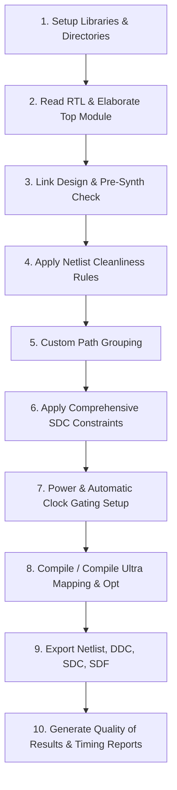

# ASIC Synthesis Flow Guide (Synopsys Design Compiler)

A comprehensive, industry-standard reference guide for the ASIC Logic Synthesis flow using **Synopsys Design Compiler (DC)**, combining all concepts, constraint methodologies, optimizations, and deliverables from the Digital Design Diploma.

---

##  Directory Organization

Before launching the synthesis flow, the script establishes the following structure:

```text
4-Synthesis/
├── master_synthesis_flow.tcl   # Unified master TCL script
├── README.md                   # Complete documentation & usage guide
├── rtl/                        # Source Verilog RTL files (*.v)
├── std_cells/                  # Standard Cell DBs (*.db) & tech files
├── results/                    # Generated netlists (.v), DB (.ddc), constraints (.sdc), delays (.sdf)
├── reports/                    # Timing, Area, Power, DRC, and QoR reports
└── work/                       # Synopsys DC temporary working library
```

---

##  How to Run the Flow

### 1. Batch Mode (Command Line / Shell)
```bash
# Run synthesis and log all terminal outputs
dc_shell -f master_synthesis_flow.tcl | tee synthesis.log
```

### 2. Interactive Mode (Inside DC Shell)
```tcl
dc_shell> source -echo master_synthesis_flow.tcl
```

### 3. Launching the GUI
```tcl
# Start DC with GUI or launch inside dc_shell:
dc_shell -gui
# or in script:
start_gui
```

---

##  Synthesis Flow Breakdown (Step-by-Step)



---

### Step 1: Environment & Multi-Corner PVT Library Setup
In synthesis, libraries model cell delays, area, and power under specific Process, Voltage, and Temperature (PVT) operating corners:
- **`search_path`**: Specifies directory paths where DC looks for RTL and DB files.
- **`target_library`**: Standard cell library used for technology mapping (e.g. Slow corner for setup).
- **`link_library`**: Includes `*` (DC memory cache), `target_library`, hard macros, and IP blocks.

```tcl
set SSLIB "scmetro_tsmc_cl013g_rvt_ss_1p08v_125c.db"   ;# Max delay (Setup)
set TTLIB "scmetro_tsmc_cl013g_rvt_tt_1p2v_25c.db"     ;# Typical
set FFLIB "scmetro_tsmc_cl013g_rvt_ff_1p32v_m40c.db"   ;# Min delay (Hold)

set target_library [list $SSLIB $TTLIB $FFLIB]
set link_library   [list * $SSLIB $TTLIB $FFLIB]
```

---

### Step 2 & 3: RTL Ingestion, Linking & Consistency
- **`read_file -format verilog <files>`** or **`analyze` + `elaborate`**: Reads Verilog files into DC memory.
- **`current_design <top>`**: Selects the active design root.
- **`link`**: Resolves module instances with corresponding library entities.
- **`check_design`**: Inspects missing connections, unconnected pins, and multi-driven nets before synthesis starts.

---

### Step 4: Netlist Cleanliness & Hard Macro Protection
- **`set_fix_multiple_port_nets -all -buffer_constants -feedthroughs`**: Prevents `assign` statements in the final Verilog netlist by inserting buffers on constant drivers and feedthrough nets.
- **`set_dont_touch`**: Protects custom sub-blocks, hard macros, or manual clock-gating cells (`CLK_GATE`) from modification or optimization.

---

### Step 5: Path Grouping
By default, DC optimizes against the overall worst negative slack (WNS). If an I/O path is violating, it might ignore internal register-to-register paths. Grouping ensures balanced optimization across all path categories:
```tcl
group_path -name INREG  -from [all_inputs]
group_path -name REGOUT -to   [all_outputs]
group_path -name INOUT  -from [all_inputs] -to [all_outputs]
```

---

### Step 6: Timing Constraints (SDC)

#### 6.1 Master Clocks
Defines the main clock port, period, and waveform:
```tcl
create_clock -name MASTER_CLK -period 10.0 -waveform {0 5.0} [get_ports CLK]
set_clock_uncertainty -setup 0.2 [get_clocks MASTER_CLK]
set_clock_uncertainty -hold  0.1 [get_clocks MASTER_CLK]
set_clock_transition  -rise 0.05 [get_clocks MASTER_CLK]
set_clock_transition  -fall 0.05 [get_clocks MASTER_CLK]
```

#### 6.2 Generated Clocks
For clock dividers or gated clock nodes:
```tcl
# Divided Clock
create_generated_clock -name "REG_CLK" -source [get_ports CLK] \
                       -master_clock MASTER_CLK -divide_by 2 [get_pins U0_ClkDiv/o_div_clk]

# Gated Clock (divide_by 1)
create_generated_clock -name "ALU_CLK" -source [get_ports CLK] \
                       -master_clock MASTER_CLK -divide_by 1 [get_pins U0_CLK_GATE/GATED_CLK]
```

#### 6.3 High-Fanout Protection
Prevents DC from building high-fanout buffer trees on clocks and reset signals (which are handled during Clock Tree Synthesis in PnR):
```tcl
set_dont_touch_network [get_clocks [all_clocks]]
set_dont_touch_network [get_ports {RST rst_n}]
```

#### 6.4 Clock Domain Crossing (CDC) & Asynchronous Clocks
- **Asynchronous Clock Groups**:
  ```tcl
  set_clock_groups -asynchronous -group [get_clocks CLKA_DOMAIN] -group [get_clocks CLKB_DOMAIN]
  ```
- **False Paths**:
  ```tcl
  set_false_path -from [get_clocks CLKA_DOMAIN] -to [get_clocks CLKB_DOMAIN]
  ```
- **Max Delay (Constraining Multi-bit CDC Busses)**:
  ```tcl
  set_max_delay 5.0 -from [get_cells U0_SER_2_PAR/PAR_DATA*] -to [get_cells U0_DATA_SYNC/sync_bus*]
  ```

#### 6.5 Multicycle Paths (MCP)
When logic takes multiple clock cycles to evaluate:
```tcl
# Setup constraint for N cycles (e.g., 2 cycles)
set_multicycle_path -setup 2 -from [get_clocks REG_CLK] -to [get_clocks ALU_CLK]
# Hold constraint adjusted to (N-1) cycles at the destination
set_multicycle_path -hold  1 -from [get_clocks REG_CLK] -to [get_clocks ALU_CLK] -end
```

#### 6.6 I/O Delays, Driving Cells & Loads
- **`set_input_delay` / `set_output_delay`**: Models off-chip timing budgets (e.g. 20%-30% of $T_{clk}$).
- **`set_driving_cell`**: Models realistic transition slope on inputs using a standard library buffer (e.g. `BUFX2M`).
- **`set_load`**: Models external load capacitance on outputs (e.g. `0.5 pF`).
- **`set_operating_conditions`**: Links Min (FF corner) and Max (SS corner) conditions for multi-corner analysis.
- **`set_wire_load_model`**: Pre-layout wire RC estimation.

---

### Step 7 & 8: Low-Power Optimization & Compilation
- **Automatic Clock Gating (ICG)**:
  ```tcl
  set_clock_gating_style -minimum_bitwidth 5 -positive_edge_logic {integrated}
  ```
- **Compile Ultra**:
  ```tcl
  compile_ultra -gate_clock -no_autoungroup
  ```
  *(Or `compile -map_effort high -gate_clock`)*

---

### Step 9: Exporting Synthesis Outputs

The following files are exported to `results/`:

| File | Format | Purpose |
| :--- | :--- | :--- |
| `<top>_netlist.v` | Verilog | Gate-level mapped netlist for PnR & Simulation |
| `<top>.ddc` | Synopsys DDC | Binary database containing design hierarchy, attributes & mapping |
| `<top>.sdc` | Synopsys Design Constraints | Standard timing constraints passed to Place & Route (PnR) and STA |
| `<top>.sdf` | Standard Delay Format | Back-annotated gate and interconnect timing delays for gate-level simulations |

---

### Step 10: Reports & Quality of Results (QoR)

All analysis summaries are exported to `reports/`:
- **`area.rpt`**: Hierarchical cell count, combinational vs. sequential area.
- **`power.rpt`**: Static leakage power, dynamic switching & internal power.
- **`setup.rpt`**: Max delay timing paths, critical path slack ($WNS$, $TNS$).
- **`hold.rpt`**: Min delay timing paths for hold analysis.
- **`clocks.rpt`**: Clock waveform, period, and skew attributes.
- **`constraints.rpt`**: Summary of timing, slew, load, or capacitance violations.
- **`qor.rpt`**: High-level synthesis summary of timing, area, and DRC metrics.
- **`clock_gating.rpt`**: Number and percentage of registers gated.

---

##  Best Practice Checklist

1. [x] Always verify that `link` and `check_design` produce **0 unresolved references / errors**.
2. [x] Ensure `set_fix_multiple_port_nets` is called **before** the `compile` command.
3. [x] Never allow DC to insert clock buffers during synthesis; keep `set_dont_touch_network` on all clock and reset trees.
4. [x] Specify `-end` when defining multicycle hold paths between different clocks.
5. [x] Verify that all CDC paths are properly constrained with either `set_clock_groups`, `set_false_path`, or `set_max_delay`.
6. [x] Check `reports/constraints.rpt` to ensure no setup or design rule violations (DRC: max_transition, max_capacitance, max_fanout).
