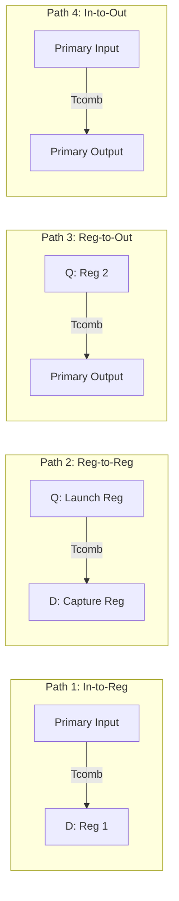

# Static Timing Analysis (STA) Master Reference & Guide

A comprehensive, mathematical and practical reference guide for **Static Timing Analysis (STA)** and **Synopsys PrimeTime (PT)**, consolidating all concepts, formulas, timing checks, and violation-fixing methodologies from the Digital Design Diploma.

---

##  Master STA Script

- **Script**: [`master_sta_script.tcl`](file:///c:/Users/user/Desktop/DigitalDesign/Digital_Design_Diploma/5-STA/master_sta_script.tcl)

---

##  How to Run PrimeTime STA

```bash
# Batch mode execution with log capture:
pt_shell -f master_sta_script.tcl | tee sta.log

# Interactive GUI mode:
pt_shell -gui
```

---

##  The 4 Fundamental Timing Paths

STA decomposes every digital design into four primary timing paths:



| Path Type | Startpoint | Endpoint | Clock Constraints |
| :--- | :--- | :--- | :--- |
| **1. In-to-Reg** | Primary Input Port | D-pin of Flip-Flop | `set_input_delay` & `create_clock` |
| **2. Reg-to-Reg** | CK-pin of Launch Flip-Flop | D-pin of Capture Flip-Flop | `create_clock` on Launch & Capture |
| **3. Reg-to-Out** | CK-pin of Launch Flip-Flop | Primary Output Port | `create_clock` & `set_output_delay` |
| **4. In-to-Out** | Primary Input Port | Primary Output Port | `set_input_delay` & `set_output_delay` |

---

##  Core Timing Parameters & Definitions

| Parameter | Symbol | Description |
| :--- | :---: | :--- |
| **Clock Period** | $T_{period}$ / $T_{clk}$ | Time between consecutive active clock edges ($T = 1/F_{clk}$). |
| **Clock-to-Q Delay** | $T_{cq}$ / $T_{clk\rightarrow q}$ | Propagation delay from clock active edge to data available at Q pin. |
| **Combinational Delay** | $T_{comb}$ | Total propagation delay through logic gates and interconnect wires. |
| **Setup Time** | $T_{setup}$ | Minimum time data must remain stable **BEFORE** the active clock edge. |
| **Hold Time** | $T_{hold}$ | Minimum time data must remain stable **AFTER** the active clock edge. |
| **Clock Latency** | $T_{latency}$ | Delay from clock source/generator to clock pin of the flip-flop. |
| **Clock Skew** | $T_{skew}$ | Difference in clock arrival times between capture and launch flops: <br> $$T_{skew} = T_{capture\_clk} - T_{launch\_clk}$$ |
| **Clock Uncertainty** | $T_{unc}$ | Margin allocated for clock jitter, duty cycle variation, and skew. |

---

##  Mathematical Timing Formulations

### 1. Setup Timing Analysis (Max Delay Check)

Setup analysis ensures data arrives **before** the capture clock edge so the flip-flop latches correct data.

```text
Launch Edge (t=0)                          Capture Edge (t=T_period)
     |                                                 |
     v                                                 v
CLK1 |---> [ Launch Flop ] ---> [ Combinational Logic ] ---> [ Capture Flop ] <---| CLK2
     |         T_cq                     T_comb                     T_setup        |
     |----(T_launch_clk)---->                       <----(T_capture_clk)----------|
```

#### Formulas:
$$\text{Data Arrival Time} = T_{launch\_clk} + T_{cq\_max} + T_{comb\_max}$$

$$\text{Data Required Time} = T_{period} + T_{capture\_clk} - T_{setup} - T_{unc\_setup}$$

$$\text{Setup Slack} = \text{Data Required Time} - \text{Data Arrival Time} \ge 0$$

#### Maximum Operating Frequency ($F_{max}$):
To avoid setup violation ($\text{Slack}_{setup} \ge 0$):
$$T_{period} \ge T_{cq\_max} + T_{comb\_max} + T_{setup} + T_{unc\_setup} - (T_{capture\_clk} - T_{launch\_clk})$$

$$T_{period\_min} = T_{cq\_max} + T_{comb\_max} + T_{setup} + T_{unc\_setup} - T_{skew}$$

$$F_{max} = \frac{1}{T_{period\_min}}$$

> **Impact of Clock Skew on Setup:**
> - **Positive Skew** ($T_{capture\_clk} > T_{launch\_clk}$): **Helps setup** (gives more time for data to arrive).
> - **Negative Skew** ($T_{capture\_clk} < T_{launch\_clk}$): **Hurts setup** (reduces available timing budget).

---

### 2. Hold Timing Analysis (Min Delay Check)

Hold analysis ensures new data launched at the current clock edge does **not** race ahead and corrupt data being latched by the same clock edge at the capture flip-flop.

```text
Launch Edge (t=0)                           Capture Edge (t=0)
     |                                                 |
     v                                                 v
CLK1 |---> [ Launch Flop ] ---> [ Combinational Logic ] ---> [ Capture Flop ] <---| CLK2
     |         T_cq                     T_comb                     T_hold         |
     |----(T_launch_clk)---->                       <----(T_capture_clk)----------|
```

#### Formulas:
$$\text{Data Arrival Time} = T_{launch\_clk} + T_{cq\_min} + T_{comb\_min}$$

$$\text{Data Required Time} = T_{capture\_clk} + T_{hold} + T_{unc\_hold}$$

$$\text{Hold Slack} = \text{Data Arrival Time} - \text{Data Required Time} \ge 0$$

$$\text{Condition:} \quad T_{cq\_min} + T_{comb\_min} \ge T_{hold} + T_{unc\_hold} + (T_{capture\_clk} - T_{launch\_clk})$$

> [!IMPORTANT]
> **Key Hold Analysis Properties:**
> 1. Hold checks are performed at the **same active clock edge ($t=0$)**.
> 2. Hold timing is **completely independent of the clock period ($T_{period}$)**. Increasing the clock period will **never** fix a hold violation!
> 3. **Positive Skew hurts hold**, while **Negative Skew helps hold**.

---

### 3. Reset Timing: Recovery & Removal Checks

For asynchronous resets asserted asynchronously but de-asserted synchronously:

- **Recovery Time ($T_{recovery}$)**: Minimum time the asynchronous reset must be de-asserted **before** the next active clock edge (analogous to Setup check).
- **Removal Time ($T_{removal}$)**: Minimum time the asynchronous reset must remain asserted **after** the active clock edge before de-assertion (analogous to Hold check).

---

##  Timing Exceptions & SDC Constraints

### 1. Multicycle Paths (MCP)
Used when a combinational data path is architected to evaluate over $N$ clock cycles instead of 1.

```tcl
# Setup check relaxed by N cycles (e.g., 2 cycles):
set_multicycle_path -setup 2 -from [get_clocks CLK_A] -to [get_clocks CLK_B]

# Hold check adjusted back to (N-1) cycles at the capture destination:
set_multicycle_path -hold  1 -from [get_clocks CLK_A] -to [get_clocks CLK_B] -end
```

### 2. False Paths
Disables timing analysis on paths that are physically impossible or functionally asynchronous:
```tcl
# Asynchronous Clock Domains:
set_clock_groups -asynchronous -group [get_clocks CLK_A] -group [get_clocks CLK_B]

# Or dedicated false paths:
set_false_path -from [get_clocks CLK_A] -to [get_clocks CLK_B]
set_false_path -from [get_ports reset_n]
```

### 3. Max & Min Delay (Data Bus CDC)
```tcl
set_max_delay 4.0 -from [get_cells U_FIFO/wr_ptr*] -to [get_cells U_FIFO/rd_ptr*]
```

---

##  Advanced STA Concepts: OCV & CPPR

### 1. On-Chip Variation (OCV) & Derating
Variations in process, supply voltage, and temperature across the die can cause different cells on the same chip to run faster or slower.
- **Setup OCV**: Derate launch path late (slow down) and capture path early (speed up).
- **Hold OCV**: Derate launch path early (speed up) and capture path late (slow down).

```tcl
set_timing_derate -early 0.95 -cell_delay
set_timing_derate -late  1.05 -cell_delay
```

### 2. Common Path Pessimism Removal (CPPR / CRPR)
When launch and capture clock paths share common clock tree buffers, the shared cells cannot simultaneously be fast and slow. CPPR removes this artificial pessimism:
```tcl
set timing_remove_clock_reconvergence_pessimism true
```

---

##  How to Fix Timing Violations

| Violation Type | Root Cause | Fix Method / Solution |
| :--- | :--- | :--- |
| **Setup Violation** ($\text{Slack} < 0$) | Data path too slow ($T_{comb}$ too large) | 1. **Upsize cells** in the critical path (increase drive strength).<br>2. **Restructure / pipeline** combinational logic (insert registers).<br>3. **Reduce load / fanout** by cloning gates.<br>4. **Lower clock frequency** ($T_{period} \uparrow$).<br>5. **Useful clock skew** (delay capture clock). |
| **Hold Violation** ($\text{Slack} < 0$) | Data path too fast ($T_{comb}$ too short) | 1. **Insert delay buffers** in the data path ($T_{comb} \uparrow$).<br>2. **Downsize launch cells** to increase propagation delay.<br>3. *(Note: Changing clock frequency does NOT fix hold!)* |
