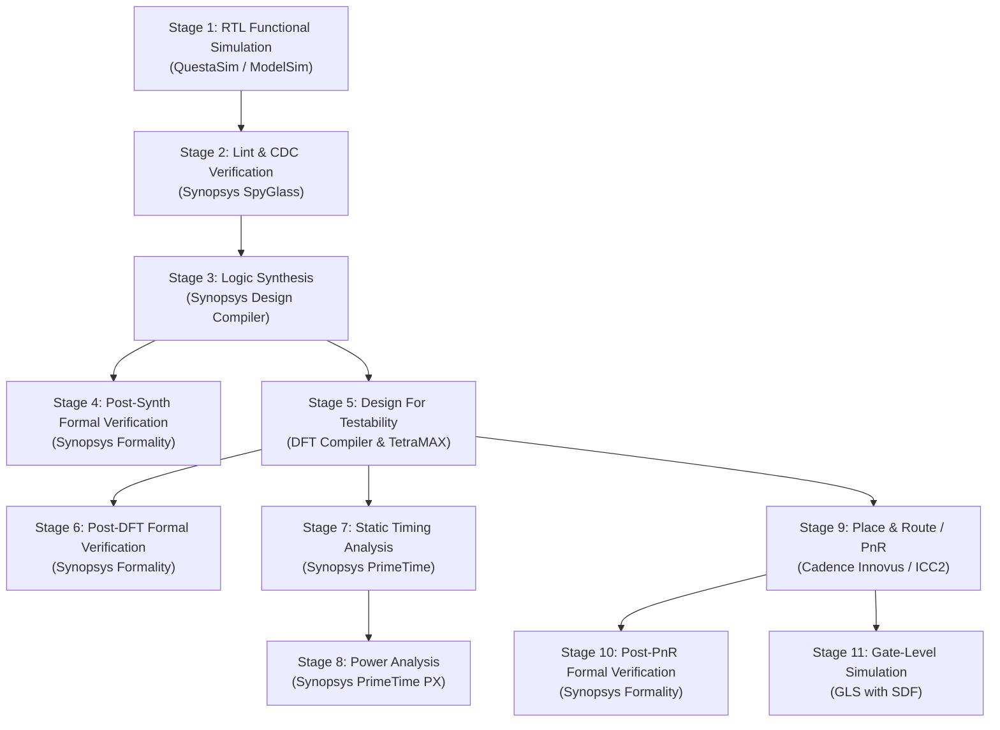

# UART System ASIC Implementation Flow Guide

A comprehensive, step-by-step implementation and verification guide for the **UART / `SYS_TOP` System** across the entire digital ASIC design flow, based on the **Digital Design Diploma** curriculum.

---

## 📋 Table of Contents
1. [System Architecture & Module Hierarchy](#1-system-architecture--module-hierarchy)
2. [Complete ASIC Flow Roadmap](#2-complete-asic-flow-roadmap)
3. [Stage 1: RTL Functional Verification (QuestaSim / ModelSim)](#stage-1-rtl-functional-verification-questasim--modelsim)
4. [Stage 2: Static Verification (SpyGlass Lint & CDC)](#stage-2-static-verification-spyglass-lint--cdc)
5. [Stage 3: Logic Synthesis (Synopsys Design Compiler)](#stage-3-logic-synthesis-synopsys-design-compiler)
6. [Stage 4: Formal Verification Post-Synthesis (Synopsys Formality)](#stage-4-formal-verification-post-synthesis-synopsys-formality)
7. [Stage 5: Design For Testability & ATPG (DFT Compiler & TetraMAX)](#stage-5-design-for-testability--atpg-dft-compiler--tetramax)
8. [Stage 6: Formal Verification Post-DFT (Synopsys Formality)](#stage-6-formal-verification-post-dft-synopsys-formality)
9. [Stage 7: Static Timing Analysis (Synopsys PrimeTime)](#stage-7-static-timing-analysis-synopsys-primetime)
10. [Stage 8: Power Analysis (PrimeTime PX / PTPX)](#stage-8-power-analysis-primetime-px--ptpx)
11. [Stage 9: Physical Design / Place & Route (Innovus / ICC2)](#stage-9-physical-design--place--route-innovus--icc2)
12. [Stage 10: Formal Verification Post-PnR (Synopsys Formality)](#stage-10-formal-verification-post-pnr-synopsys-formality)
13. [Stage 11: Gate-Level Simulation (GLS)](#stage-11-gate-level-simulation-gls)
14. [Project Directory & File Deliverables Matrix](#14-project-directory--file-deliverables-matrix)

---

## 1. System Architecture & Module Hierarchy

The system consists of dual asynchronous clock domains: **Reference Clock Domain (`REF_CLK`)** and **UART Clock Domain (`UART_CLK`)**.

```
SYS_TOP (Top-Level)
├── SYS_CTRL (Main Controller FSM)
│   ├── CTRL_RX
│   └── CTRL_TX
├── UART (Full Duplex Transceiver)
│   ├── UART_RX (Sampler, Deserializer, Edge/Bit Counter, Parity/Start/Stop Checkers, FSM)
│   └── UART_TX (Serializer, Parity Calculator, Multiplexer, FSM)
├── ALU (Arithmetic & Logic Unit: 16 Operations)
├── RegFile (16x8-bit Configuration & Status Registers)
├── ClkDiv (Clock Divider for UART Baud Generation & Prescaling)
├── CLK_GATE (Integrated Clock Gating Cell for ALU dynamic power reduction)
├── CLKDIV_MUX (Clock Divider Multiplexer)
├── RST_SYNC (Reset Synchronizer for Async Assertion / Sync Deassertion)
├── DATA_SYNC (Multi-bit Bus Synchronizer with Pulse Generator Enable)
├── ASYNC_FIFO (Asynchronous Dual-Clock FIFO for TX Data Buffering)
└── PULSE_GEN (Edge-to-Pulse Generation)
```

---

## 2. Complete ASIC Flow Roadmap



---

## Stage 1: RTL Functional Verification (QuestaSim / ModelSim)

### Objective
Verify that all system operations (Register Write, Register Read, ALU operations with/without operands) function correctly according to specifications.

### Source Files
* Defined in: `6-System/Backend/Synthesis/system.lst`
* Testbench: `SYS_TOP_tb.v`

### Commands
```bash
# Compile design files and testbench
vlog -f system.lst SYS_TOP_tb.v

# Run simulation with full signal visibility
vsim -voptargs=+acc work.SYS_TOP_tb

# Inside ModelSim/QuestaSim GUI/CLI:
run -all
```

### Key Deliverables
* Simulation log showing 100% test coverage for all command frames.
* Waveform database (`SYS_TOP.vcd` or `SYS_TOP.wlf`).

---

## Stage 2: Static Verification (SpyGlass Lint & CDC)

### Objective
Detect syntax/structural issues, uninitialized flip-flops, combinational loops, latches, and clock domain crossing metastability/synchronization issues before synthesis.

### Reference Scripts
* **Lint Script**: `3-SpyGlass/Lint/master_spyglass_lint_flow.tcl`
* **CDC Script**: `3-SpyGlass/CDC/master_spyglass_cdc_flow.tcl`

### Commands
```bash
# 1. Run SpyGlass Lint
spyglass -tcl master_spyglass_lint_flow.tcl

# 2. Run SpyGlass CDC
spyglass -tcl master_spyglass_cdc_flow.tcl
```

### Key Deliverables
* Clean Lint Report (0 Errors, 0 Fatal).
* Clean CDC Report (All cross-domain paths synchronized with 2-FF synchronizers, DMUX/data sync, or Async FIFO).

---

## Stage 3: Logic Synthesis (Synopsys Design Compiler)

### Objective
Translate Verilog RTL into target technology gate-level netlist (TSMC 130nm) while meeting timing, area, and power constraints.

### Directory & Files
* **Working Directory**: `6-System/Backend/Synthesis/`
* **Synthesis Script**: `syn_script.tcl`
* **SDC Constraints**: `cons.tcl`
* **File List**: `system.lst`
* **Shell Runner**: `run_syn.sh`
* **Diploma Reference Guide**: `4-Synthesis/master_synthesis_flow.tcl`

### Commands
```bash
cd 6-System/Backend/Synthesis
dc_shell -f syn_script.tcl | tee syn.log
```

### Output Deliverables
* Gate Netlist: `netlists/SYS_TOP.v`
* Synopsys DB: `netlists/SYS_TOP.ddc`
* Design Constraints: `sdc/SYS_TOP.sdc`
* Standard Delay Format: `sdf/SYS_TOP.sdf`
* Formality Guide: `SYS_TOP.svf`
* Quality Reports: `reports/setup.rpt`, `reports/hold.rpt`, `reports/area.rpt`, `reports/power.rpt`, `reports/constraints.rpt`

---

## Stage 4: Formal Verification Post-Synthesis (Synopsys Formality)

### Objective
Formally prove that the synthesized gate netlist (`SYS_TOP.v`) is functionally equivalent to the golden RTL.

### Directory & Files
* **Working Directory**: `6-System/Backend/Formality/post-syn/`
* **Formality Script**: `syn_fm_script.tcl`
* **Runner**: `run_syn_fm.tcl`
* **Diploma Reference Guide**: `9-Formal Verification/master_formality_flow.tcl`

### Commands
```bash
cd 6-System/Backend/Formality/post-syn
fm_shell -f run_syn_fm.tcl | tee fm_post_syn.log
```

### Key Deliverables
* Formality Status: `Verification SUCCEEDED` (0 non-equivalent compare points).

---

## Stage 5: Design For Testability & ATPG (DFT Compiler & TetraMAX)

### Objective
Replace standard sequential cells with scan flip-flops, stitch scan chains, verify test protocol DRC, and generate manufacturing test patterns with high fault coverage.

### Directory & Files
* **Working Directory**: `6-System/Backend/DFT/`
* **DFT Script**: `dft_script.tcl`
* **DFT Constraints**: `cons.tcl`
* **File List**: `system.lst`
* **Shell Runner**: `run_dft.sh`
* **Diploma Reference Guide**: `10-DFT/master_dft_flow.tcl`

### Commands
```bash
cd 6-System/Backend/DFT
dc_shell -f dft_script.tcl | tee dft.log
```

### Output Deliverables
* Scan-Inserted Netlist: `netlists/SYS_TOP_dft.v`
* DFT SDC: `sdc/SYS_TOP_dft.sdc`
* Test Protocol (STIL/SPF): `spf/SYS_TOP.spf`
* Formality Guide: `SYS_TOP_dft.svf`
* DFT Reports: `reports/scan_path.rpt`, `reports/dft_drc.rpt`, `reports/coverage.rpt`

---

## Stage 6: Formal Verification Post-DFT (Synopsys Formality)

### Objective
Verify that scan insertion and test logic did not alter functional operation (by constraining `test_mode` to `0`).

### Directory & Files
* **Working Directory**: `6-System/Backend/Formality/post-dft/`
* **Formality Script**: `dft_fm_script.tcl`
* **Runner**: `run_dft_fm.tcl`

### Commands
```bash
cd 6-System/Backend/Formality/post-dft
fm_shell -f run_dft_fm.tcl | tee fm_post_dft.log
```

### Key Deliverables
* Formality Status: `Verification SUCCEEDED`.

---

## Stage 7: Static Timing Analysis (Synopsys PrimeTime)

### Objective
Perform multi-corner sign-off timing analysis across PVT operating corners (SS @ 1.08V, 125°C for Setup; FF @ 1.32V, -40°C for Hold) and verify false paths / clock relationships.

### Directory & Files
* **Diploma Reference Guide**: `5-STA/master_sta_script.tcl`
* **Documentation**: `5-STA/README.md`

### Commands
```bash
cd 5-STA
pt_shell -f master_sta_script.tcl | tee sta.log
```

### Key Deliverables
* Setup Slack report (WNS >= 0, TNS = 0).
* Hold Slack report (WNS >= 0, TNS = 0).
* Timing Violators report (`report_constraint -all_violators`).

---

## Stage 8: Power Analysis (PrimeTime PX / PTPX)

### Objective
Measure average dynamic power (switching + internal) and static power (leakage) using switching activity annotations from functional simulation.

### Directory & Files
* **Reference Directory**: `7-Power/`
* **Inputs**: Gate netlist (`SYS_TOP.v`), standard cell `.db`, and switching activity file (`SYS_TOP.vcd` / `SYS_TOP.saif`).

### Commands
```bash
cd 7-Power
pt_shell -f pt_power.tcl | tee power.log
```

### Key Deliverables
* Hierarchical power breakdown report (`reports/power_summary.rpt`).

---

## Stage 9: Physical Design / Place & Route (Innovus / ICC2)

### Objective
Transform gate-level netlist into a manufacturable physical layout (GDSII) meeting DRC, LVS, and antenna rules.

### Directory & Files
* **Diploma Reference Guide**: `12-PNR/master_pnr_flow.tcl`
* **Documentation**: `12-PNR/README.md`

### Flow Stages
1. **Design Import & Tech Setup**: Read `SYS_TOP_dft.v`, LEF files, `.sdc`, `.lib`.
2. **Floorplanning & Pin Placement**: Set aspect ratio, core utilization (~70%), pin assignments.
3. **Power Planning**: Build VDD/VSS Power Rings, Stripes, and standard cell Rails.
4. **Placement & Pre-CTS Optimization**: Standard cell placement with timing-driven optimization.
5. **Clock Tree Synthesis (CTS)**: Build balanced clock trees for `REF_CLK`, `UART_CLK`, and generated clocks.
6. **Routing & Post-Route Optimization**: Global and detail routing, crosstalk and setup/hold timing closure.
7. **Finishing & Physical Verification**: Add filler cells, DCAP cells, run DRC and LVS checks.

### Commands
```bash
innovus -files master_pnr_flow.tcl
```

### Output Deliverables
* Routed Netlist: `SYS_TOP_pnr.v`
* GDSII Layout: `SYS_TOP.gds`
* Parasitics File: `SYS_TOP.spef`
* Post-PnR Timing: `SYS_TOP_pnr.sdf` and `SYS_TOP_pnr.sdc`

---

## Stage 10: Formal Verification Post-PnR (Synopsys Formality)

### Objective
Ensure that physical layout changes (CTS buffer insertion, scan chain reordering, cell sizing) did not alter design logic.

### Directory & Files
* **Working Directory**: `6-System/Backend/Formality/post-PnR/`
* **Formality Script**: `pnr_fm_script.tcl`
* **Runner**: `run_pnr_fm.tcl`

### Commands
```bash
cd 6-System/Backend/Formality/post-PnR
fm_shell -f run_pnr_fm.tcl | tee fm_post_pnr.log
```

### Key Deliverables
* Formality Status: `Verification SUCCEEDED`.

---

## Stage 11: Gate-Level Simulation (GLS)

### Objective
Verify dynamic behavior of the final netlist back-annotated with actual standard cell and interconnect delays (`.sdf`) to catch race conditions, hold hazards, and asynchronous reset recovery/removal violations.

### Directory & Files
* **Diploma Reference Guide**: `11-GLS/master_gls_flow.tcl`
* **Documentation**: `11-GLS/README.md`
* **Inputs**:
  * Routed Netlist: `SYS_TOP_pnr.v`
  * SDF Timing Delays: `SYS_TOP_pnr.sdf`
  * Standard Cell Verilog Model: `scmetro_tsmc_cl013g_rvt.v` / `tsmc13.v`
  * Testbench: `SYS_TOP_tb.v`

### Commands
```bash
# Compile standard cell models, netlist, and testbench
vlog -v /path/to/tsmc13_cells.v SYS_TOP_pnr.v SYS_TOP_tb.v

# Run simulation with maximum SDF back-annotation
vsim -t 1ps -sdfmax /uut=SYS_TOP_pnr.sdf work.SYS_TOP_tb
```

### Key Deliverables
* Timing simulation passing all testbench checks without `$setuphold`, `$recovery`, or `$removal` timing violation warnings.

---

## 14. Project Directory & File Deliverables Matrix

| Stage | Tool | Input Files | Primary Scripts | Generated Deliverables |
| :--- | :--- | :--- | :--- | :--- |
| **1. RTL Sim** | QuestaSim | `system.lst`, `SYS_TOP_tb.v` | `run_sim.do` | `SYS_TOP.vcd` / `SYS_TOP.wlf` |
| **2. Lint & CDC** | SpyGlass | Verilog RTL, `.sgdc` | `master_spyglass_lint_flow.tcl`<br>`master_spyglass_cdc_flow.tcl` | Lint & CDC Reports |
| **3. Synthesis** | Design Compiler | RTL, `system.lst`, `.db` | `syn_script.tcl`<br>`cons.tcl` | `SYS_TOP.v`, `SYS_TOP.sdc`, `SYS_TOP.sdf`, `SYS_TOP.svf` |
| **4. FM Post-Synth** | Formality | RTL (Golden), `SYS_TOP.v` (Revised) | `syn_fm_script.tcl` | Equivalence Report (`SUCCEEDED`) |
| **5. DFT** | DFT Compiler | `SYS_TOP.v`, `cons.tcl` | `dft_script.tcl` | `SYS_TOP_dft.v`, `SYS_TOP_dft.sdc`, `SYS_TOP.spf` |
| **6. FM Post-DFT** | Formality | `SYS_TOP.v` (Golden), `SYS_TOP_dft.v` | `dft_fm_script.tcl` | Equivalence Report (`SUCCEEDED`) |
| **7. STA** | PrimeTime | `SYS_TOP_dft.v`, `.sdc`, `.db` | `master_sta_script.tcl` | Setup/Hold Timing Sign-off Reports |
| **8. Power** | PrimeTime PX | `SYS_TOP_dft.v`, `.vcd` / `.saif` | `pt_power.tcl` | Dynamic & Static Power Reports |
| **9. PnR** | Innovus / ICC2 | `SYS_TOP_dft.v`, `.sdc`, LEF, `.lib` | `master_pnr_flow.tcl` | `SYS_TOP_pnr.v`, `SYS_TOP.gds`, `SYS_TOP.spef` |
| **10. FM Post-PnR**| Formality | `SYS_TOP_dft.v` (Golden), `SYS_TOP_pnr.v` | `pnr_fm_script.tcl` | Equivalence Report (`SUCCEEDED`) |
| **11. GLS** | QuestaSim / VCS| `SYS_TOP_pnr.v`, `SYS_TOP_pnr.sdf`, Tech Models | `master_gls_flow.tcl` | Validated Timing Waveforms & Logs |
