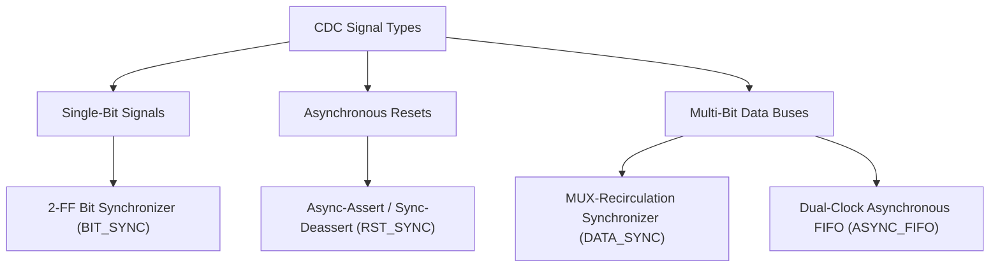
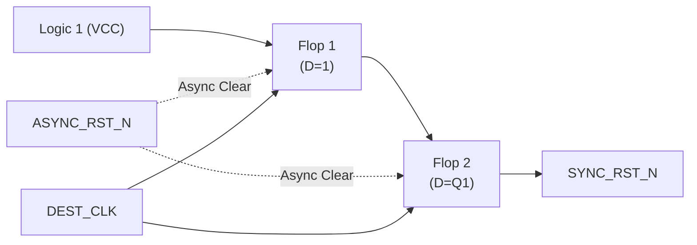
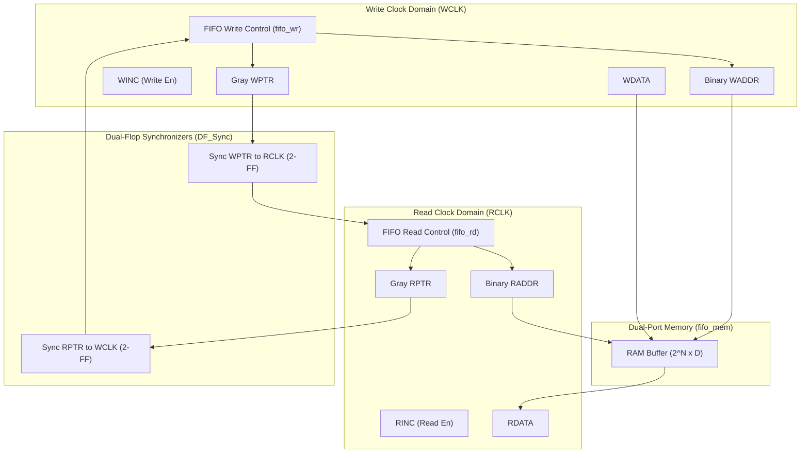

# Clock Domain Crossing (CDC) Design & Synchronization Master Guide

A comprehensive, industry-standard reference guide for **Clock Domain Crossing (CDC)** design principles, synchronizer architectures, metastability mitigation, and **Asynchronous FIFO** design from the Digital Design Diploma.

---

##  Master CDC Simulation Script

- **Master Script**: [`master_cdc_sim_flow.tcl`](file:///c:/Users/user/Desktop/DigitalDesign/Digital_Design_Diploma/8-CDC/master_cdc_sim_flow.tcl)

---

##  How to Run the CDC Simulation Flow

```bash
# In ModelSim / QuestaSim (GUI Mode):
vsim -do master_cdc_sim_flow.tcl

# In Batch / Command-Line Mode:
vsim -c -do master_cdc_sim_flow.tcl
```

---

##  Fundamentals of Metastability & CDC

### 1. What Causes Metastability?
When a digital signal crosses from a source clock domain ($\text{CLK}_A$) to an asynchronous destination clock domain ($\text{CLK}_B$), it may violate the **Setup Time ($T_{\text{setup}}$)** or **Hold Time ($T_{\text{hold}}$)** of the destination flip-flop. 

This forces the internal feedback transistors into an undefined intermediate voltage level between logic `'0'` and `'1'`, known as a **Metastable State**.

```text
                  +-------------------+
                  | Setup/Hold Window |
                  +-------------------+
Clock Edge:                 |
                     _______|________
Data Transition:   -----\  X  /------   ==> Causes METASTABILITY
                         \___/
```

### 2. Mean Time Between Failures (MTBF)
The reliability of a synchronizer is quantified by the MTBF formula:

$$\text{MTBF} = \frac{e^{\frac{T_{\text{res}}}{\tau}}}{T_0 \cdot f_{\text{clk}} \cdot f_{\text{data}}}$$

- $T_{\text{res}} = T_{\text{clk}} - T_{\text{setup}} - T_{\text{co}}$: Available settling resolution time.
- $\tau, T_0$: Technology-dependent transistor parameters.
- $f_{\text{clk}}$: Destination clock frequency.
- $f_{\text{data}}$: Incoming asynchronous data transition frequency.

Adding a second flip-flop (2-FF synchronizer) exponentially increases $T_{\text{res}}$, raising MTBF from seconds to thousands of years.

---

##  CDC Synchronizer Architectures



---

### 1. Bit Synchronizer (`BIT_SYNC`)
Used exclusively for **single-bit scalar control signals**. Cascades two or more flip-flops in the destination domain to resolve metastability before the signal is sampled by downstream combinational logic.

```verilog
// 2-Flip-Flop Bit Synchronizer Pattern:
module bit_sync #(parameter NUM_STAGES = 2) (
    input  wire clk,
    input  wire rst_n,
    input  wire async_in,
    output wire sync_out
);
    reg [NUM_STAGES-1:0] sync_reg;

    always @(posedge clk or negedge rst_n) begin
        if (!rst_n)
            sync_reg <= {NUM_STAGES{1'b0}};
        else
            sync_reg <= {sync_reg[NUM_STAGES-2:0], async_in};
    end

    assign sync_out = sync_reg[NUM_STAGES-1];
endmodule
```

---

### 2. Reset Synchronizer (`RST_SYNC`)
Solves the **Reset Recovery and Removal** timing challenge:
- **Assertion**: Must be **Asynchronous** so the system resets immediately regardless of whether the clock is running.
- **De-assertion**: Must be **Synchronous** to the destination clock edge to ensure all flip-flops exit the reset state on the exact same clock cycle.



```verilog
module rst_sync (
    input  wire clk,
    input  wire rst_n,        // Asynchronous reset input
    output reg  sync_rst_n    // Synchronized reset output
);
    reg q1;

    always @(posedge clk or negedge rst_n) begin
        if (!rst_n) begin
            q1         <= 1'b0;
            sync_rst_n <= 1'b0;
        end else begin
            q1         <= 1'b1;
            sync_rst_n <= q1;
        end
    end
endmodule
```

---

### 3. Multi-Bit Data Synchronizer (`DATA_SYNC`)
Never pass multi-bit buses through multiple parallel 2-FF synchronizers (due to variable flip-flop delay skew, which causes data bus coherence failure). 

Instead, use a **MUX-Recirculation Synchronizer**:
1. Source domain holds the multi-bit `unsync_bus` steady.
2. Source sends a 1-bit `bus_enable` pulse.
3. The `bus_enable` pulse passes through a 2-FF synchronizer into destination domain.
4. Destination pulse-generator creates an enable strobe to load the stable data bus into the destination register.

---

### 4. Dual-Clock Asynchronous FIFO (`ASYNC_FIFO`)
The universal high-throughput CDC solution for streaming multi-bit data between independent clock domains.



#### Gray Code Conversion & Pointer Synchronization
Because binary counters change multiple bits simultaneously (e.g., $3 \rightarrow 4$ is `011` $\rightarrow$ `100`), sampling during transitions produces erroneous values. **Gray Code guarantees only 1 bit changes per increment**:

$$\text{Gray} = \text{Binary} \oplus (\text{Binary} \gg 1)$$

#### Full and Empty Mathematical Conditions
With an address width of $N$ bits ($2^N$ depth), write and read pointers use an extra $(N+1)$-th MSB to distinguish between full and empty:

1. **FIFO Empty Condition** (Evaluated in Read Domain):
   $$\text{rptr\_gray} == \text{wptr\_gray\_sync}$$

2. **FIFO Full Condition** (Evaluated in Write Domain):
   The write pointer has wrapped around and caught up with the read pointer:
   $$\text{wptr\_gray}[N:N-1] == \sim\text{rptr\_gray\_sync}[N:N-1] \quad \text{AND} \quad \text{wptr\_gray}[N-2:0] == \text{rptr\_gray\_sync}[N-2:0]$$

---

##  Asynchronous FIFO Depth Calculation (`FIFO_DEPTH`)

When transmitting data bursts between clock domains of different frequencies:

### Universal FIFO Depth Equation:
$$\text{FIFO Depth} = B - \left( B \times \frac{f_{\text{RD}}}{f_{\text{WR}}} \times \frac{N_{\text{WR}}}{N_{\text{RD}}} \right)$$

- $B$: Burst size (number of data items transferred in a single burst).
- $f_{\text{WR}}, f_{\text{RD}}$: Write and Read clock frequencies.
- $N_{\text{WR}}$: Number of write clock cycles required to write 1 data item.
- $N_{\text{RD}}$: Number of read clock cycles required to read 1 data item.

### Example Problem:
- $f_{\text{WR}} = 100\text{ MHz}$ ($T_{\text{WR}} = 10\text{ ns}$), continuous write ($N_{\text{WR}} = 1$)
- $f_{\text{RD}} = 40\text{ MHz}$ ($T_{\text{RD}} = 25\text{ ns}$), continuous read ($N_{\text{RD}} = 1$)
- Burst Size $B = 80$ items.

$$\text{Time to write burst} = 80 \times 10\text{ ns} = 800\text{ ns}$$
$$\text{Items read during this time} = \frac{800\text{ ns}}{25\text{ ns}} = 32\text{ items}$$
$$\text{Required FIFO Depth} = 80 - 32 = 48\text{ entries} \quad (\text{Round to nearest } 2^N = 64)$$

---

##  Summary Comparison of CDC Synchronizers

| Synchronizer Type | Safe Signal Width | Latency | Overhead | Primary Use Cases |
| :--- | :---: | :---: | :---: | :--- |
| **2-FF Bit Synchronizer** | 1 bit | 2 cycles | Minimal (2 FFs) | Single control flags, edge detect strobes |
| **Reset Synchronizer** | 1 bit | 0 cyc assert / 2 cyc deassert | Minimal (2 FFs) | Asynchronous active-low/high chip resets |
| **MUX Data Synchronizer** | $N$ bits | 2–3 cycles | Low | Multi-bit configuration buses, quasi-static data |
| **Handshake Controller** | $N$ bits | 4–6 cycles | Medium | Low-throughput burst data with backpressure |
| **Dual-Clock Async FIFO** | $N$ bits | 1 cycle (streaming) | Medium-High (SRAM + Logic) | High-speed continuous streaming, UART/AXI bridges |

---

##  CDC Labs & Assignments Directory Structure

```text
8-CDC/
├── README.md                      # Complete CDC Hardware Design Reference
├── master_cdc_sim_flow.tcl        # Unified ModelSim/QuestaSim regression test script
├── Labs/
│   └── BIT_SYNC/                  # Lab 1: 2-FF Bit Synchronizer
│       ├── BIT_SYNC.pdf           # Lab manual
│       └── Solution/              # BIT_SYNC.v & BIT_SYNC_TB.v
└── Assignments/
    ├── RST_SYNC/                  # Assignment 1: Reset Synchronizer
    │   ├── RST_SYNC.pdf           # Assignment description
    │   └── Solution/              # RST_SYNC.v & RST_SYNC_TB.v
    ├── DATA_SYNC/                 # Assignment 2: MUX-Recirculation Data Synchronizer
    │   ├── DATA_SYNC.pdf          # Assignment description
    │   └── Solution/              # DATA_SYNC.v & DATA_SYNC_TB.v
    ├── ASYNC_FIFO/                # Assignment 3: Dual-Clock Asynchronous FIFO
    │   ├── ASYNC_FIFO.pdf         # Complete Async FIFO specification
    │   └── Solution/              # Modular RTL (Async_fifo, mem, wr, rd, DF_Sync) & TB
    └── FIFO_DEPTH/                # Assignment 4: FIFO Depth Calculations
        ├── FIFO_DEPTH.pdf         # Problem sets and burst timing specs
        └── Solution/              # Detailed mathematical derivations
```
