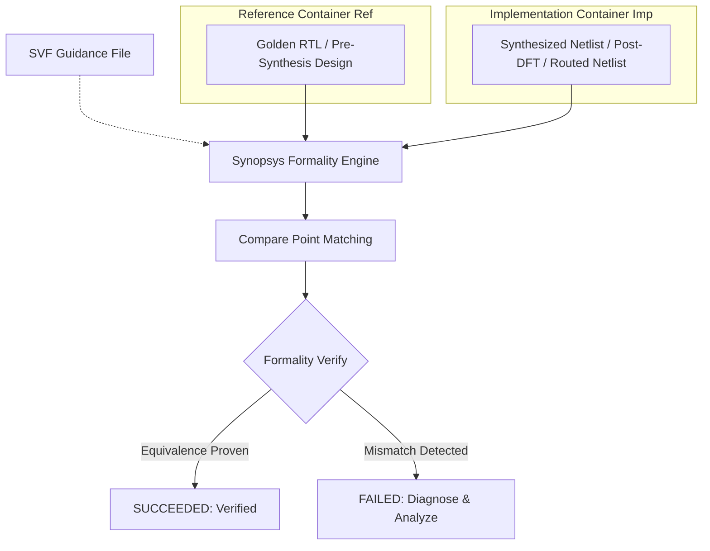

# Formal Verification (Logic Equivalence Checking - LEC) Guide

A comprehensive, industry-standard reference guide for **Formal Logic Equivalence Checking (LEC)** using **Synopsys Formality**, combining all concepts, guidance setups (SVF), DFT scan chain exclusions, compare point matching, and diagnosis techniques from the Digital Design Diploma.

---

##  Master Formality Script

- **Script**: [`master_formality_flow.tcl`](file:///c:/Users/user/Desktop/DigitalDesign/Digital_Design_Diploma/9-Formal%20Verification/master_formality_flow.tcl)

---

##  How to Run Formality

```bash
# Run in batch mode with full logging:
fm_shell -f master_formality_flow.tcl | tee formal.log

# Interactive GUI mode:
fm_shell -gui
```

---

##  What is Formal Equivalence Checking?

Formal Equivalence Checking mathematically proves that two representations of a design exhibit the exact same logical behavior across **100% of the state space**, without running simulation testbenches or generating test vectors.



---

##  Key Concepts in Formality

### 1. Containers: `Ref` vs. `Imp`
Formality organizes designs into isolated memory workspaces called **Containers**:
- **Reference Container (`Ref`)**: The golden baseline model (typically Verilog RTL or pre-DFT netlist).
- **Implementation Container (`Imp`)**: The modified design to be validated (synthesized netlist `.v`/`.ddc` or post-route netlist).

```tcl
# Setup Reference Container:
read_verilog -container Ref [list ALU_TOP.v ALU.v]
read_db -container Ref [list $SSLIB $TTLIB $FFLIB]
set_reference_design ALU_TOP
set_top ALU_TOP

# Setup Implementation Container:
read_ddc -container Imp "ALU_TOP.ddc"
read_db -container Imp [list $SSLIB $TTLIB $FFLIB]
set_implementation_design ALU_TOP
set_top ALU_TOP
```

---

### 2. The Setup Verification Format (`.svf`) Guidance File
During logic synthesis and physical optimization, Design Compiler performs complex transformations:
- Register retiming and constant register removal
- State Machine (FSM) re-encoding (e.g. Binary to One-Hot)
- Register renaming and clock gating insertion
- Boundary optimization and hierarchy manipulation

The **SVF file** records all these transformations during synthesis so Formality can map the modified gate-level implementation back to the original RTL structures without false mismatches.

#### Generating SVF in Design Compiler:
```tcl
set_svf System_Top.svf
compile -map_effort high
set_svf -off
```

#### Sourcing SVF in Formality:
```tcl
set_svf System_Top.svf
```

---

### 3. Compare Points & Logic Cones
Formality breaks sequential circuits into combinatorial **Logic Cones** bounded by **Compare Points**:

1. **Primary Output Ports**
2. **Sequential Elements** (D-inputs of Flip-Flops and Latches)
3. **Black Box Inputs**

Formality compares each corresponding output/register logic cone between `Ref` and `Imp` using Binary Decision Diagrams (BDD) and SAT solvers.

---

### 4. Handling DFT & Scan Chains in Formal Verification
When verifying a **Post-DFT Netlist** (with scan chains inserted) against **RTL**:
- Scan In (`SI`) and Scan Out (`SO`) ports exist only in the implementation netlist, not in RTL.
- Scan Enable (`SE`) and Test Mode (`test_mode`) must be held in functional mode (logic `0`).

```tcl
# 1. Ignore Scan Ports
set_dont_verify_points -type port Ref:/WORK/*/SI -quiet
set_dont_verify_points -type port Imp:/WORK/*/SI -quiet
set_dont_verify_points -type port Ref:/WORK/*/SO -quiet
set_dont_verify_points -type port Imp:/WORK/*/SO -quiet

# 2. Force Inactive Test Mode (Functional Equivalence)
set_constant Ref:/WORK/*/test_mode 0 -quiet
set_constant Imp:/WORK/*/test_mode 0 -quiet
set_constant Ref:/WORK/*/SE        0 -quiet
set_constant Imp:/WORK/*/SE        0 -quiet
```

---

##  Verification & Diagnosis Workflow

```tcl
# 1. Match Compare Points
match

# 2. Run Formal Verification
set successful [verify]

# 3. Diagnose on Failure
if {!$successful} {
    diagnose
    analyze_points -failing
}
```

---

##  Formality Reports & Deliverables

| Report File | Purpose |
| :--- | :--- |
| **`matched_points.rpt`** | Lists all successfully paired compare points between `Ref` and `Imp`. |
| **`unmatched_points.rpt`** | Lists unmatched registers or ports (must be reviewed for unintended logic elimination). |
| **`passing_points.rpt`** | Compare points mathematically proven to be identical. |
| **`failing_points.rpt`** | Compare points with logic functional mismatches. |
| **`aborted_points.rpt`** | Points where the solver exceeded time/memory complexity limits. |
| **`unverified_points.rpt`** | Unverified or unreached compare points. |

---

##  Troubleshooting Common Formal Verification Mismatches

| Cause of Failure | Root Cause Description | Resolution |
| :--- | :--- | :--- |
| **Missing SVF** | Formality cannot trace retimed registers or gated clocks. | Ensure `set_svf` is recorded during synthesis and loaded in Formality before `read_verilog`. |
| **DFT Test Mode Active** | Netlist is configured in scan shift mode instead of functional mode. | Apply `set_constant .../SE 0` and `set_constant .../test_mode 0`. |
| **Unmatched Black Boxes** | Submodules synthesized as black boxes without matching interfaces. | Ensure all macro DBs/stubs are read into both `Ref` and `Imp` containers. |
| **Unconnected Nets** | Floating inputs or tie-offs evaluated differently between RTL and gates. | Check `check_design` warnings in synthesis and Formality container logs. |
